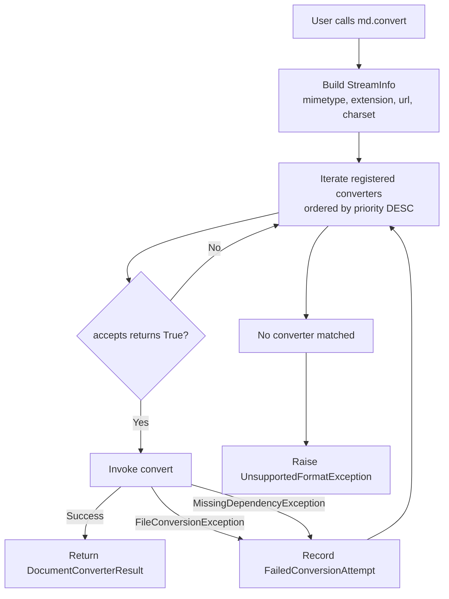
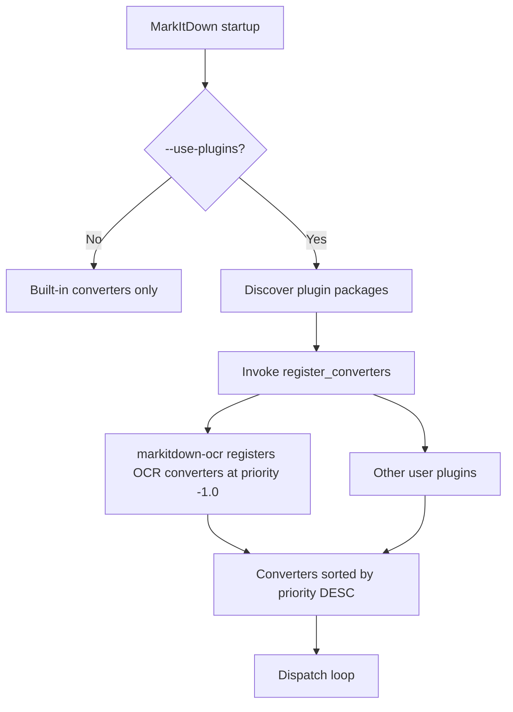
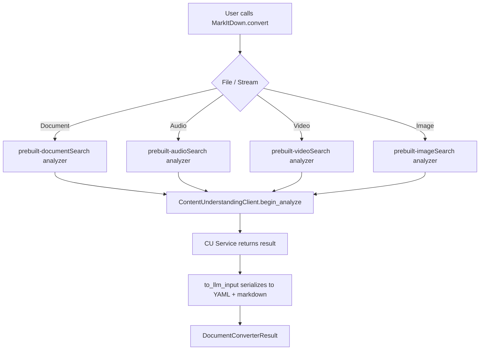
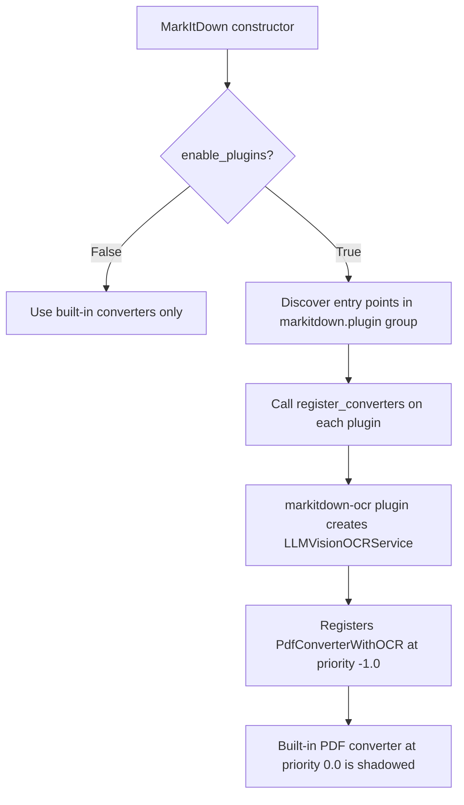
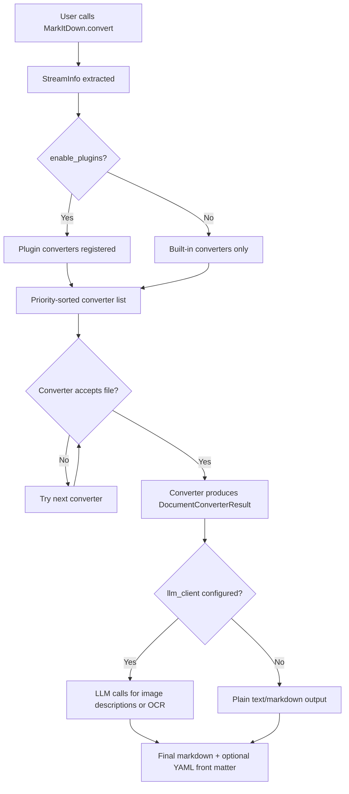
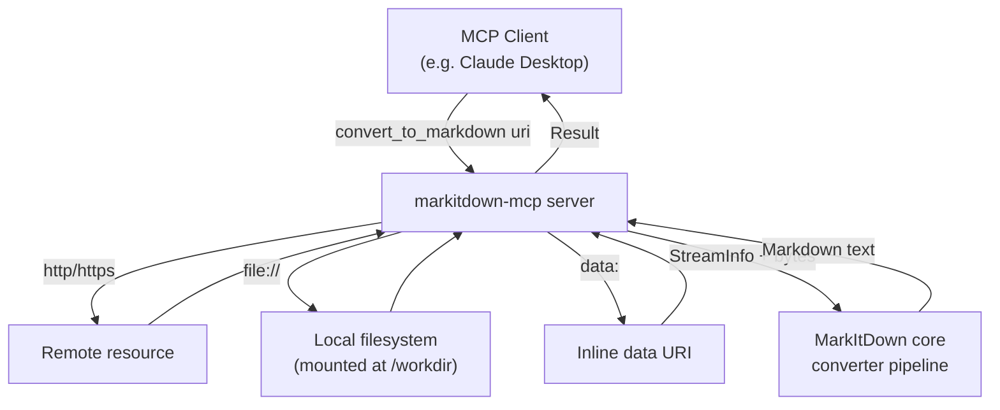
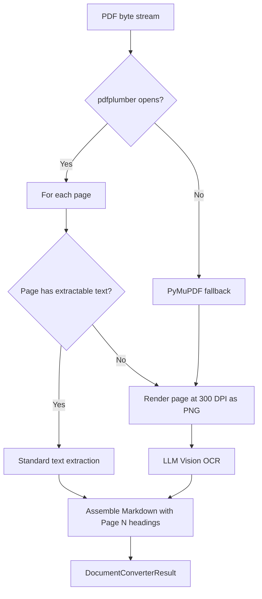
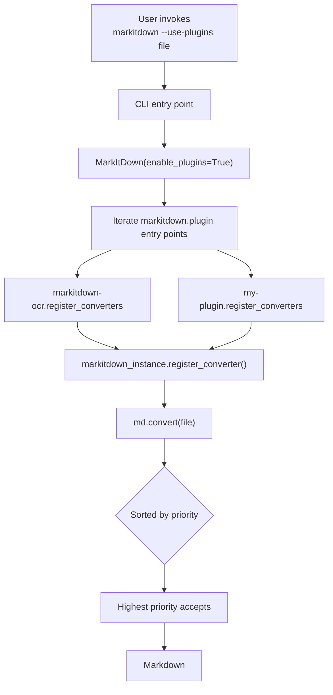

# Human Manual

## What This Pack Helps With

load MarkItDown conversion context, file-format boundaries, MCP usage notes, and verification checks into your AI host before turning documents into Markdown

## How To Use

1. Read `README.md`.
2. Load `AGENTS.md` or `CLAUDE.md`.
3. Run evals.
4. Use pitfall and risk files to recover from failure.

## What This Pack Does Not Do

- It does not replace upstream docs.
- It does not prove production readiness.
- It does not claim official endorsement.

## Doramagic Source Extract

# https://github.com/microsoft/markitdown Project Manual

Generated at: 2026-06-03 14:27:39 UTC

## Table of Contents

- [MarkItDown Overview and Core Architecture](#page-1)
- [Built-in Format Converters and Known Limitations](#page-2)
- [AI, OCR, and Cloud Integrations](#page-3)
- [Deployment, MCP Server, and Plugin Extensibility](#page-4)

<a id='page-1'></a>

## MarkItDown Overview and Core Architecture

### Related Pages

Related topics: [Built-in Format Converters and Known Limitations](#page-2), [AI, OCR, and Cloud Integrations](#page-3), [Deployment, MCP Server, and Plugin Extensibility](#page-4)

<details>
<summary>Related Source Files</summary>

The following source files were used to generate this page:

- [README.md](https://github.com/microsoft/markitdown/blob/main/README.md)
- [packages/markitdown/README.md](https://github.com/microsoft/markitdown/blob/main/packages/markitdown/README.md)
- [packages/markitdown-ocr/README.md](https://github.com/microsoft/markitdown/blob/main/packages/markitdown-ocr/README.md)
- [packages/markitdown-sample-plugin/README.md](https://github.com/microsoft/markitdown/blob/main/packages/markitdown-sample-plugin/README.md)
- [packages/markitdown/src/markitdown/converters/_pdf_converter.py](https://github.com/microsoft/markitdown/blob/main/packages/markitdown/src/markitdown/converters/_pdf_converter.py)
- [packages/markitdown/src/markitdown/converters/_cu_converter.py](https://github.com/microsoft/markitdown/blob/main/packages/markitdown/src/markitdown/converters/_cu_converter.py)
- [packages/markitdown/src/markitdown/converters/_markdownify.py](https://github.com/microsoft/markitdown/blob/main/packages/markitdown/src/markitdown/converters/_markdownify.py)
- [packages/markitdown-ocr/src/markitdown_ocr/_pdf_converter_with_ocr.py](https://github.com/microsoft/markitdown/blob/main/packages/markitdown-ocr/src/markitdown_ocr/_pdf_converter_with_ocr.py)
- [packages/markitdown-ocr/src/markitdown_ocr/_docx_converter_with_ocr.py](https://github.com/microsoft/markitdown/blob/main/packages/markitdown-ocr/src/markitdown_ocr/_docx_converter_with_ocr.py)
- [packages/markitdown/ThirdPartyNotices.md](https://github.com/microsoft/markitdown/blob/main/packages/markitdown/ThirdPartyNotices.md)
</details>

# MarkItDown Overview and Core Architecture

## 1. Purpose and Scope

MarkItDown is a lightweight Python utility for converting heterogeneous file formats into Markdown, primarily designed as a pre-processing step for LLM ingestion, text analysis, and indexing pipelines. It is "most comparable to [textract](https://github.com/deanmalmgren/textract), but with a focus on preserving important document structure and content as Markdown" — including headings, lists, tables, and links — rather than producing human-facing high-fidelity output. Source: [README.md](https://github.com/microsoft/markitdown/blob/main/README.md).

The library exposes both a **Python API** and a **command-line interface** (`markitdown`), and supports a pluggable converter architecture so third parties can register additional format handlers. The latest released version is **0.1.6**, which added an OCR layer service for embedded images and PDF scans, and fixed O(n) memory growth in PDF conversion by calling `page.close()` after each page. Source: community context referencing PR [#1541](https://github.com/microsoft/markitdown/pull/1541) and PR [#1612](https://github.com/microsoft/markitdown/pull/1612).

### 1.1 Why Markdown?

MarkItDown intentionally targets Markdown because it is "extremely close to plain text, with minimal markup or formatting, but still provides a way to represent important document structure." Mainstream LLMs (e.g., OpenAI's GPT-4o) natively consume Markdown, and Markdown conventions are also highly token-efficient. Source: [README.md](https://github.com/microsoft/markitdown/blob/main/README.md).

### 1.2 Supported File Formats (Built-in)

The built-in converters handle a broad range of common document and media formats:

| Category        | Formats                                                                 |
|-----------------|-------------------------------------------------------------------------|
| Office          | PDF, PowerPoint (`.pptx`), Word (`.docx`), Excel (`.xlsx`)              |
| Media           | Images (EXIF + OCR), Audio (EXIF + speech transcription)                |
| Web / Markup    | HTML                                                                    |
| Text-based      | CSV, JSON, XML                                                          |
| Archives        | ZIP (iterates over contents)                                            |
| References      | EPub, YouTube URLs                                                      |
| Other           | RSS, ICS (calendar), Joplin notes, Notion exports, Wikipedia dumps      |

Source: [README.md](https://github.com/microsoft/markitdown/blob/main/README.md).

> **Community note:** Support for legacy `.doc` files (issue #23) and OneNote (issue #47) has been requested. At the time of writing these formats are not part of the built-in converter set, but the plugin architecture (see §6) allows external packages to fill the gap.

## 2. Repository Layout

The repository is a monorepo containing the core library, an OCR plugin, and a sample plugin used as a reference implementation:

```
markitdown/
├── packages/
│   ├── markitdown/                  # Core Python package (CLI + API)
│   │   └── src/markitdown/
│   │       ├── __init__.py          # Public API exports
│   │       ├── _markitdown.py       # MarkItDown orchestrator class
│   │       ├── _base_converter.py   # DocumentConverter base class
│   │       ├── _stream_info.py      # StreamInfo descriptor
│   │       ├── _uri_utils.py        # Local vs URI vs stream dispatch
│   │       ├── _exceptions.py       # Custom exceptions (MissingDependency, etc.)
│   │       ├── converters/          # Built-in format converters
│   │       └── converter_utils/     # Shared helpers (docx, pdf, etc.)
│   ├── markitdown-ocr/              # Optional OCR plugin
│   │   └── src/markitdown_ocr/
│   │       ├── _ocr_service.py      # LLMVisionOCRService
│   │       ├── _pdf_converter_with_ocr.py
│   │       ├── _docx_converter_with_ocr.py
│   │       ├── _pptx_converter_with_ocr.py
│   │       └── _xlsx_converter_with_ocr.py
│   └── markitdown-sample-plugin/    # Reference plugin template
└── README.md                        # Project root documentation
```

Source: [packages/markitdown/README.md](https://github.com/microsoft/markitdown/blob/main/packages/markitdown/README.md), [packages/markitdown-ocr/README.md](https://github.com/microsoft/markitdown/blob/main/packages/markitdown-ocr/README.md), [packages/markitdown-sample-plugin/README.md](https://github.com/microsoft/markitdown/blob/main/packages/markitdown-sample-plugin/README.md).

## 3. High-Level Architecture

The architecture follows a **strategy pattern** centered on a `MarkItDown` orchestrator that delegates work to a list of `DocumentConverter` instances. Each converter is responsible for one or more file formats.

```mermaid
graph TD
    A[Caller: CLI or Python API] --> B[MarkItDown.__init__]
    B --> C{Load Built-in Converters}
    B --> D{Discover Plugins?<br/>enable_plugins=True}
    D -->|Yes| E[Iterate markitdown.plugin<br/>entry points]
    E --> F[Call register_converters&#40;md, **kwargs&#41;]
    F --> G[Plugin returns list of<br/>DocumentConverter subclasses]
    C --> H[Registry of converters]
    G --> H
    A --> I[md.convert&#40;path / uri / stream&#41;]
    I --> J[_uri_utils: pick convert_local /<br/>convert_stream / convert_uri]
    J --> K[Build StreamInfo]
    K --> L[For each converter in registry:<br/>call accepts&#40;stream, stream_info&#41;]
    L -->|First match wins| M[converter.convert&#40;stream, stream_info&#41;]
    M --> N[DocumentConverterResult]
    N --> O[result.text_content / result.markdown]
```



Key architectural properties:

- **Format dispatch is content-aware**, not just extension-based. Each converter's `accepts()` method receives a `BinaryIO` and a `StreamInfo` (containing mimetype, extension, charset, etc.) and returns a boolean. Source: [packages/markitdown-sample-plugin/README.md](https://github.com/microsoft/markitdown/blob/main/packages/markitdown-sample-plugin/README.md).
- **Converters are ordered by priority** — the sample plugin sets `priority=DocumentConverter.PRIORITY_SPECIFIC_FILE_FORMAT` so that format-specific converters run before generic ones. Source: [packages/markitdown-sample-plugin/README.md](https://github.com/microsoft/markitdown/blob/main/packages/markitdown-sample-plugin/README.md).
- **Plugin kwargs are forwarded**. The `MarkItDown.__init__` constructor forwards arbitrary keyword arguments to `register_converters(md, **kwargs)`, which is how `llm_client`, `llm_model`, and `llm_prompt` reach the `markitdown-ocr` plugin. Source: [packages/markitdown-ocr/README.md](https://github.com/microsoft/markitdown/blob/main/packages/markitdown-ocr/README.md).

## 4. Core Public API

### 4.1 The `MarkItDown` Class

The orchestrator class is the main entry point. Basic instantiation:

```python
from markitdown import MarkItDown

md = MarkItDown(enable_plugins=False)
result = md.convert("test.xlsx")
print(result.text_content)
```

Source: [README.md](https://github.com/microsoft/markitdown/blob/main/README.md).

### 4.2 `MarkItDown` Constructor Parameters

| Parameter              | Purpose                                                                          |
|------------------------|----------------------------------------------------------------------------------|
| `enable_plugins`       | Discover and register third-party converters from `markitdown.plugin` entry points. |
| `llm_client`           | OpenAI-compatible client used by image description and OCR plugins.              |
| `llm_model`            | Model name passed alongside `llm_client` (e.g., `"gpt-4o"`).                     |
| `llm_prompt`           | Optional custom prompt for image/OCR models.                                     |
| `docintel_endpoint`    | Endpoint for Microsoft Document Intelligence (legacy `az-doc-intel` extra).      |
| `cu_endpoint`          | Endpoint for Azure Content Understanding (`az-content-understanding` extra).     |
| `cu_file_types`        | List of `ContentUnderstandingFileType` restricting which files route to CU.       |
| `cu_analyzer_id`       | Optional custom analyzer ID for domain-specific field extraction.                |

Source: [README.md](https://github.com/microsoft/markitdown/blob/main/README.md), [packages/markitdown/src/markitdown/converters/_cu_converter.py](https://github.com/microsoft/markitdown/blob/main/packages/markitdown/src/markitdown/converters/_cu_converter.py).

### 4.3 The `convert()` Method and Result Object

`md.convert()` is described in the README as "intentionally permissive and can handle local files, remote URIs, and byte streams." It returns a `DocumentConverterResult` with at least:

- `text_content` — a string property exposing the Markdown.
- `markdown` — alternate accessor (used in Azure Content Understanding examples).

Source: [README.md](https://github.com/microsoft/markitdown/blob/main/README.md), [packages/markitdown/src/markitdown/converters/_cu_converter.py](https://github.com/microsoft/markitdown/blob/main/packages/markitdown/src/markitdown/converters/_cu_converter.py).

For tighter security in untrusted environments the README recommends calling the narrowest underlying helper directly — e.g. `convert_stream()` or `convert_local()`. Source: [README.md](https://github.com/microsoft/markitdown/blob/main/README.md).

## 5. The DocumentConverter Base Class

Every format handler — built-in or plugin — implements the `DocumentConverter` interface. The minimum contract, taken from the sample plugin, is:

```python
from typing import BinaryIO, Any
from markitdown import MarkItDown, DocumentConverter, DocumentConverterResult, StreamInfo

class RtfConverter(DocumentConverter):
    def __init__(self, priority: float = DocumentConverter.PRIORITY_SPECIFIC_FILE_FORMAT):
        super().__init__(priority=priority)

    def accepts(self, file_stream: BinaryIO, stream_info: StreamInfo, **kwargs: Any) -> bool:
        # Inspect stream/stream_info to decide whether this converter owns the file
        raise NotImplementedError()

    def convert(
        self,
        file_stream: BinaryIO,
        stream_info: StreamInfo,
        **kwargs: Any,
    ) -> DocumentConverterResult:
        # Produce the Markdown output
        raise NotImplementedError()
```

Source: [packages/markitdown-sample-plugin/README.md](https://github.com/microsoft/markitdown/blob/main/packages/markitdown-sample-plugin/README.md).

| Method / Attribute                | Responsibility                                                            |
|-----------------------------------|---------------------------------------------------------------------------|
| `__init__(priority=...)`          | Stores priority; higher priority converters are tried first.              |
| `accepts(stream, stream_info)`    | Returns `True` if the converter can handle the input.                     |
| `convert(stream, stream_info)`    | Performs the actual conversion and returns a `DocumentConverterResult`.  |
| `PRIORITY_SPECIFIC_FILE_FORMAT`   | Standard priority constant for format-specific converters.               |
| `register_converters(md, **kw)`   | Module-level entry point used by plugin discovery.                        |

## 6. Plugin System

MarkItDown ships with a Python entry-points-based plugin system. Plugins are discovered when the user passes `enable_plugins=True` to `MarkItDown()` or `--use-plugins` to the CLI. Source: [README.md](https://github.com/microsoft/markitdown/blob/main/README.md), [packages/markitdown-ocr/README.md](https://github.com/microsoft/markitdown/blob/main/packages/markitdown-ocr/README.md).

### 6.1 Plugin Discovery Flow

```mermaid
graph LR
    A[MarkItDown&#40;enable_plugins=True&#41;] --> B[Importlib entry_points&#40;group='markitdown.plugin'&#41;]
    B --> C[For each loaded module: call register_converters&#40;md, **kwargs&#41;]
    C --> D[register_converters instantiates converters and appends to md.converters]
    D --> E[Converters participate in the normal accepts&#40;&#41; / convert&#40;&#41; pipeline]
```



Plugins must:

1. Declare a module that exports `register_converters(md: MarkItDown, **kwargs)`.
2. Export a constant `__plugin_interface_version__ = 1` (the only currently supported version).
3. Implement one or more `DocumentConverter` subclasses.
4. Advertise the entry point in `pyproject.toml` under the `markitdown.plugin` group.

Source: [packages/markitdown-sample-plugin/README.md](https://github.com/microsoft/markitdown/blob/main/packages/markitdown-sample-plugin/README.md), [packages/markitdown-ocr/README.md](https://github.com/microsoft/markitdown/blob/main/packages/markitdown-ocr/README.md).

### 6.2 The `markitdown-ocr` Plugin

The `markitdown-ocr` package is the canonical example of a real plugin. It is installed as a separate wheel (`pip install markitdown-ocr`) and uses the existing `llm_client` / `llm_model` arguments to perform OCR on embedded images via LLM Vision. Source: [packages/markitdown-ocr/README.md](https://github.com/microsoft/markitdown/blob/main/packages/markitdown-ocr/README.md).

| Converter                         | Format | Behavior                                                                                  |
|-----------------------------------|--------|-------------------------------------------------------------------------------------------|
| `PdfConverterWithOCR`             | PDF    | Extracts text from page-rendered images; full-page OCR fallback for scanned PDFs.         |
| `DocxConverterWithOCR`            | DOCX   | Subclasses `HtmlConverter`; uses a placeholder token so mammoth never sees OCR markers.   |
| `PptxConverterWithOCR`            | PPTX   | Extracts text from images embedded in slides.                                             |
| `XlsxConverterWithOCR`            | XLSX   | Extracts text from images embedded in worksheets.                                         |

Source: [packages/markitdown-ocr/README.md](https://github.com/microsoft/markitdown/blob/main/packages/markitdown-ocr/README.md), [packages/markitdown-ocr/src/markitdown_ocr/_pdf_converter_with_ocr.py](https://github.com/microsoft/markitdown/blob/main/packages/markitdown-ocr/src/markitdown_ocr/_pdf_converter_with_ocr.py), [packages/markitdown-ocr/src/markitdown_ocr/_docx_converter_with_ocr.py](https://github.com/microsoft/markitdown/blob/main/packages/markitdown-ocr/src/markitdown_ocr/_docx_converter_with_ocr.py).

Usage:

```python
from markitdown import MarkItDown
from openai import OpenAI

md = MarkItDown(
    enable_plugins=True,
    llm_client=OpenAI(),
    llm_model="gpt-4o",
)
result = md.convert("document_with_images.pdf")
print(result.text_content)
```

If no `llm_client` is provided, the plugin "still loads, but OCR is silently skipped — falling back to the standard built-in converter." Source: [packages/markitdown-ocr/README.md](https://github.com/microsoft/markitdown/blob/main/packages/markitdown-ocr/README.md).

> **Community note (issue #1179):** Several users have asked for Homebrew installation. As of 0.1.6, MarkItDown is distributed via PyPI (`pip install markitdown[all]`) and as a Docker image. There is no official Homebrew formula.

## 7. PDF Conversion Subsystem (Worked Example)

PDF handling is the most complex built-in converter and illustrates the layered design of the project. Two backends cooperate:

1. **pdfplumber** — used for word-position analysis to detect borderless forms/tables.
2. **pdfminer.six** — used as the primary text extractor, with fallback behavior when pdfplumber fails.

Source: [packages/markitdown/src/markitdown/converters/_pdf_converter.py](https://github.com/microsoft/markitdown/blob/main/packages/markitdown/src/markitdown/converters/_pdf_converter.py).

### 7.1 Form/Table Detection

`_pdf_converter.py` groups words by rounded Y-position (`y_tolerance = 5`) and analyzes the resulting rows to decide whether a page is "form-style" (borderless tables). If at least one page is form-style, the converter renders only those pages with pdfplumber and falls back to pdfminer for the rest. If no pages are form-style, pdfminer is used for the whole document — yielding better text spacing for prose. Source: [packages/markitdown/src/markitdown/converters/_pdf_converter.py](https://github.com/microsoft/markitdown/blob/main/packages/markitdown/src/markitdown/converters/_pdf_converter.py).

### 7.2 Memory Management

A known failure mode of long PDFs was O(n) memory growth. The 0.1.6 release fixed this by calling `page.close()` after each page is processed, freeing the cached page data immediately. Source: community context referencing PR [#1612](https://github.com/microsoft/markitdown/pull/1612), [packages/markitdown/src/markitdown/converters/_pdf_converter.py](https://github.com/microsoft/markitdown/blob/main/packages/markitdown/src/markitdown/converters/_pdf_converter.py).

### 7.3 OCR Fallback for Scanned PDFs

When the page is image-only (no extractable text), the `markitdown-ocr` plugin renders the page to a PNG at 300 DPI and feeds the bytes to the `LLMVisionOCRService`:

```text
Page → pdfplumber.to_image(resolution=300) → PNG bytes
      → LLMVisionOCRService.extract_text(stream) → "## Page N\n[Image OCR]\n…\n[End OCR]"
```

If pdfplumber itself fails (e.g. "malformed EOF"), the plugin falls back to PyMuPDF (`fitz`) for rendering. Source: [packages/markitdown-ocr/src/markitdown_ocr/_pdf_converter_with_ocr.py](https://github.com/microsoft/markitdown/blob/main/packages/markitdown-ocr/src/markitdown_ocr/_pdf_converter_with_ocr.py).

> **Community note (issues #293 and #296):** Multiple users have reported that table recognition in PDFs is imperfect and that PDF output is closer to raw text than to structured Markdown. The form-style heuristic in `_pdf_converter.py` is the current best-effort answer; for higher fidelity, the README recommends Microsoft Document Intelligence or Azure Content Understanding.

## 8. Azure Cloud Integrations

The README documents two cloud-backed alternatives for higher-fidelity conversion. Both are optional and require an `extras` install:

| Integration                    | Extra                            | Strengths                                                                  | Limitations                                                |
|--------------------------------|----------------------------------|----------------------------------------------------------------------------|------------------------------------------------------------|
| Azure Document Intelligence    | `az-doc-intel`                   | Cloud layout extraction; better table and form handling.                   | Billable; no structured field exposure; no audio/video.     |
| Azure Content Understanding    | `az-content-understanding`       | Multimodal (docs, images, audio, **video**); YAML front-matter fields.     | Billable; requires a CU endpoint; fields not always exposed. |

Source: [README.md](https://github.com/microsoft/markitdown/blob/main/README.md), [packages/markitdown/src/markitdown/converters/_cu_converter.py](https://github.com/microsoft/markitdown/blob/main/packages/markitdown/src/markitdown/converters/_cu_converter.py).

```python
from markitdown import MarkItDown

md = MarkItDown(cu_endpoint="<content_understanding_endpoint>")
result = md.convert("report.pdf")   # auto-routes to prebuilt-documentSearch
result = md.convert("meeting.mp4")  # auto-routes to prebuilt-videoSearch
result = md.convert("call.wav")     # auto-routes to prebuilt-audioSearch
print(result.markdown)
```

Source: [README.md](https://github.com/microsoft/markitdown/blob/main/README.md).

`_cu_converter.py` lazily imports the `azure-ai-contentunderstanding` SDK; if the import fails, the module installs stub classes and records `_dependency_exc_info` for a later, descriptive `MissingDependencyException`. This is the same pattern used by the OCR plugin and other optional converters. Source: [packages/markitdown/src/markitdown/converters/_cu_converter.py](https://github.com/microsoft/markitdown/blob/main/packages/markitdown/src/markitdown/converters/_cu_converter.py).

## 9. The HTML / Markdownify Subsystem

HTML conversion is implemented as a subclass of `markdownify.MarkdownConverter`. The custom subclass in `_markdownify.py` adjusts the following behaviors:

- Uses `'#'`, `'##'`, … (ATX) headings rather than Setext underlines.
- Removes JavaScript hyperlinks to avoid leaking `javascript:` URIs into the Markdown.
- Truncates `data:` URI images that exceed a size threshold by default (`keep_data_uris=False`).
- Ensures URIs are URL-escaped and do not collide with Markdown syntax characters.

Source: [packages/markitdown/src/markitdown/converters/_markdownify.py](https://github.com/microsoft/markitdown/blob/main/packages/markitdown/src/markitdown/converters/_markdownify.py).

```python
def convert_hn(self, n, el, text, convert_as_inline=False, **kwargs):
    if not convert_as_inline:
        if not re.search(r"^\n", text):
            return "\n" + super().convert_hn(n, el, text, convert_as_inline)
    return super().convert_hn(n, el, text, convert_as_inline)
```

Source: [packages/markitdown/src/markitdown/converters/_markdownify.py](https://github.com/microsoft/markitdown/blob/main/packages/markitdown/src/markitdown/converters/_markdownify.py).

A side effect of this design is that the `markitdown-ocr` plugin can safely inject OCR output by substituting a unique placeholder token (`MARKITDOWNOCRBLOCK{n}`) for each image before handing the document to `mammoth`, then resolving the placeholders back into OCR text. This ensures `mammoth` never sees OCR markers. Source: [packages/markitdown-ocr/src/markitdown_ocr/_docx_converter_with_ocr.py](https://github.com/microsoft/markitdown/blob/main/packages/markitdown-ocr/src/markitdown_ocr/_docx_converter_with_ocr.py).

## 10. Installation Matrix

MarkItDown uses optional-dependency "extras" so users only pull in the libraries they need.

| Command                                              | Adds                                                            |
|------------------------------------------------------|-----------------------------------------------------------------|
| `pip install markitdown[all]`                        | All built-in format dependencies.                               |
| `pip install markitdown`                             | Bare core only.                                                 |
| `pip install markitdown-ocr`                         | The `markitdown-ocr` plugin (requires `markitdown[all]`).       |
| `pip install openai`                                 | An OpenAI-compatible client (for `llm_client`).                 |
| `pip install markitdown[az-doc-intel]`               | Azure Document Intelligence SDK.                                |
| `pip install markitdown[az-content-understanding]`   | Azure Content Understanding SDK.                                |
| `pip install -e packages/markitdown[all]`            | Editable install from source (after `git clone`).               |

Source: [README.md](https://github.com/microsoft/markitdown/blob/main/README.md), [packages/markitdown/README.md](https://github.com/microsoft/markitdown/blob/main/packages/markitdown/README.md), [packages/markitdown-ocr/README.md](https://github.com/microsoft/markitdown/blob/main/packages/markitdown-ocr/README.md).

> **Community note (issue #1179):** Installing only the CLI currently requires pulling in the entire core package via `pip install markitdown[all]`. There is an open request to publish a CLI-only or Homebrew-distributed build that avoids the heavy ML stack (e.g., `magika`) on systems that only need command-line conversion.

## 11. Docker

A `Dockerfile` is provided at the repository root. The image exposes the `markitdown` CLI and reads from stdin:

```sh
docker build -t markitdown:latest .
docker run --rm -i markitdown:latest < ~/your-file.pdf > output.md
```

Source: [README.md](https://github.com/microsoft/markitdown/blob/main/README.md).

## 12. Security Considerations

MarkItDown performs I/O with the privileges of the current process. "Like `open()` or `requests.get()`, it will access resources that the process itself can access." The README and the package README both highlight two defensive patterns:

1. **Sanitize inputs** in untrusted or server-side contexts. This includes restricting file paths, limiting URI schemes, blocking private/loopback/link-local/metadata-service addresses, etc.
2. **Use the narrowest conversion method** — e.g. `convert_stream()` or `convert_local()` — instead of the permissive top-level `convert()` when only a subset of inputs is expected.

Source: [README.md](https://github.com/microsoft/markitdown/blob/main/README.md), [packages/markitdown/README.md](https://github.com/microsoft/markitdown/blob/main/packages/markitdown/README.md).

A secondary concern is **network binding** warnings when the CLI is used interactively: a 0.1.6 commit updated the warning text for binding to non-local interfaces. Source: community context referencing PR by @afourney.

## 13. Third-Party Notices

The project redistributes code from the `dwml` project (an Office Math ML processor), reformatted with `black`, and uses its `latex_dict.py` and `omml.py` files in `packages/markitdown/src/markitdown/converter_utils/docx/math`. The reformat and namespace usage are documented in PR #1160 and are subject to the Apache 2.0 license. Source: [packages/markitdown/ThirdPartyNotices.md](https://github.com/microsoft/markitdown/blob/main/packages/markitdown/ThirdPartyNotices.md).

## 14. Common Failure Modes and Workarounds

| Symptom                                                   | Likely cause                                                                                  | Workaround                                                                                              |
|-----------------------------------------------------------|-----------------------------------------------------------------------------------------------|---------------------------------------------------------------------------------------------------------|
| `MissingDependencyException` on `markitdown.convert()`    | An optional extra (e.g. `az-doc-intel`, `pptx`, `pdf`) is not installed.                    | Install the matching extra, e.g. `pip install markitdown[all]`.                                         |
| PDF table cells merged or columns misaligned (#293)       | `pdfplumber` form-style heuristic does not detect the layout.                                | Switch to Microsoft Document Intelligence or Azure Content Understanding.                                |
| PDF output is essentially plain text (#296)               | Document is image-based or has no text layer; pdfminer returns nothing useful.               | Enable `markitdown-ocr` plugin with an LLM Vision model, or use a cloud backend.                         |
| `pip install markitdown` pulls in too much (#1179)        | Current `pyproject` requires ML stack even for CLI-only use.                                  | Wait for a CLI-only distribution; meanwhile use the Docker image for cleaner environments.             |
| Old `.doc` files rejected (#23)                           | Built-in converter only handles `.docx` (Office Open XML).                                    | Save the file as `.docx` first, or implement a custom `DocumentConverter` for the OLE2 `.doc` format.   |
| OneNote files rejected (#47)                              | No built-in converter exists.                                                                | Implement a plugin (e.g. parsing the OneNote `onetoc2` and section file formats) and register it.      |

## 15. Development Workflow

- **Package layout**: Work inside `packages/markitdown` for core changes.
- **Test runner**: The project uses `hatch`. Run `pip install hatch`, then `hatch shell` and `hatch test`. A Devcontainer is provided as an alternative.
- **Pre-commit**: Run `pre-commit run --all-files` before submitting a pull request.
- **CLA**: Microsoft requires a Contributor License Agreement; the CLA bot annotates PRs automatically.

Source: [README.md](https://github.com/microsoft/markitdown/blob/main/README.md).

## 16. See Also

- [MarkItDown PDF Converter Internals](./markitdown-pdf-converter.md) — deep dive into the `pdfplumber` + `pdfminer` pipeline, the form-style table heuristic, and the OCR fallback.
- [MarkItDown Plugin Development Guide](./markitdown-plugin-development.md) — how to implement a `DocumentConverter`, package it as a plugin, and advertise it via the `markitdown.plugin` entry point.
- [MarkItDown OCR Plugin](./markitdown-ocr-plugin.md) — covers `LLMVisionOCRService`, the per-format override converters, and the placeholder-token trick used to keep OCR output out of `mammoth`'s HTML pass.
- [MarkItDown Azure Content Understanding Integration](./markitdown-cu-integration.md) — covers `cu_endpoint`, analyzer selection, and the YAML front-matter field output.
- [MarkItDown Security Considerations](./markitdown-security.md) — best practices for untrusted input and narrow API usage.

---

<a id='page-2'></a>

## Built-in Format Converters and Known Limitations

### Related Pages

Related topics: [MarkItDown Overview and Core Architecture](#page-1), [AI, OCR, and Cloud Integrations](#page-3)

<details>
<summary>Related Source Files</summary>

The following source files were used to generate this page:

- [packages/markitdown/src/markitdown/__init__.py](https://github.com/microsoft/markitdown/blob/main/packages/markitdown/src/markitdown/__init__.py)
- [packages/markitdown/src/markitdown/_base_converter.py](https://github.com/microsoft/markitdown/blob/main/packages/markitdown/src/markitdown/_base_converter.py)
- [packages/markitdown/src/markitdown/converters/_pdf_converter.py](https://github.com/microsoft/markitdown/blob/main/packages/markitdown/src/markitdown/converters/_pdf_converter.py)
- [packages/markitdown/src/markitdown/converters/_html_converter.py](https://github.com/microsoft/markitdown/blob/main/packages/markitdown/src/markitdown/converters/_html_converter.py)
- [packages/markitdown/src/markitdown/converters/_wikipedia_converter.py](https://github.com/microsoft/markitdown/blob/main/packages/markitdown/src/markitdown/converters/_wikipedia_converter.py)
- [packages/markitdown/src/markitdown/converters/_cu_converter.py](https://github.com/microsoft/markitdown/blob/main/packages/markitdown/src/markitdown/converters/_cu_converter.py)
- [packages/markitdown/src/markitdown/_markitdown.py](https://github.com/microsoft/markitdown/blob/main/packages/markitdown/src/markitdown/_markitdown.py)
- [packages/markitdown/src/markitdown/_stream_info.py](https://github.com/microsoft/markitdown/blob/main/packages/markitdown/src/markitdown/_stream_info.py)
- [packages/markitdown/src/markitdown/_exceptions.py](https://github.com/microsoft/markitdown/blob/main/packages/markitdown/src/markitdown/_exceptions.py)
- [packages/markitdown-ocr/src/markitdown_ocr/_plugin.py](https://github.com/microsoft/markitdown/blob/main/packages/markitdown-ocr/src/markitdown_ocr/_plugin.py)
- [packages/markitdown-ocr/src/markitdown_ocr/_pdf_converter_with_ocr.py](https://github.com/microsoft/markitdown/blob/main/packages/markitdown-ocr/src/markitdown_ocr/_pdf_converter_with_ocr.py)
- [packages/markitdown-ocr/src/markitdown_ocr/_docx_converter_with_ocr.py](https://github.com/microsoft/markitdown/blob/main/packages/markitdown-ocr/src/markitdown_ocr/_docx_converter_with_ocr.py)
- [packages/markitdown-ocr/src/markitdown_ocr/_pptx_converter_with_ocr.py](https://github.com/microsoft/markitdown/blob/main/packages/markitdown-ocr/src/markitdown_ocr/_pptx_converter_with_ocr.py)
- [packages/markitdown-sample-plugin/README.md](https://github.com/microsoft/markitdown/blob/main/packages/markitdown-sample-plugin/README.md)
- [README.md](https://github.com/microsoft/markitdown/blob/main/README.md)
</details>

# Built-in Format Converters and Known Limitations

## Overview

MarkItDown is a lightweight Python utility for converting heterogeneous file formats (PDF, Office documents, images, audio, HTML, structured text, archives, and more) into Markdown for downstream consumption by LLMs and text analysis pipelines ([README.md](https://github.com/microsoft/markitdown)). The conversion pipeline is implemented as a registry of pluggable `DocumentConverter` classes. Each converter declares which inputs it can handle and provides a conversion routine that emits a `DocumentConverterResult` containing Markdown text and an optional title.

The public surface is intentionally narrow. A user instantiates `MarkItDown`, calls `md.convert(...)`, and receives a result. The internal mechanics — input sniffing, converter selection, plugin loading, fallback behavior — are abstracted behind that call surface ([`packages/markitdown/src/markitdown/__init__.py`](https://github.com/microsoft/markitdown/blob/main/packages/markitdown/src/markitdown/__init__.py)).

### Design Goals

- **Markdown-first output.** Output is optimized for token efficiency and LLM consumption, not for pixel-faithful document rendering ([README.md](https://github.com/microsoft/markitdown)).
- **Pluggable architecture.** Third parties can register additional converters without modifying core code, via the plugin interface defined in the sample plugin ([`packages/markitdown-sample-plugin/README.md`](https://github.com/microsoft/markitdown/blob/main/packages/markitdown-sample-plugin/README.md)).
- **Process-local I/O.** MarkItDown runs with the privileges of the current process; users are responsible for sanitizing untrusted inputs and calling the narrowest `convert_*` helper appropriate to their use case ([README.md](https://github.com/microsoft/markitdown)).

## Converter Architecture

### Class Hierarchy

All converters derive from the abstract `DocumentConverter` class, which defines two contract methods and a priority constant ([`packages/markitdown/src/markitdown/_base_converter.py`](https://github.com/microsoft/microsoft/markitdown/blob/main/packages/markitdown/src/markitdown/_base_converter.py)):

- `accepts(file_stream, stream_info, **kwargs) -> bool` — a quick, *non-throwing* test of whether the converter should attempt conversion of a given input.
- `convert(file_stream, stream_info, **kwargs) -> DocumentConverterResult` — performs the actual conversion. Implementations may raise `FileConversionException`, `MissingDependencyException`, or other exceptions defined in [`packages/markitdown/src/markitdown/_exceptions.py`](https://github.com/microsoft/markitdown/blob/main/packages/markitdown/src/markitdown/_exceptions.py).

The result type `DocumentConverterResult` exposes the converted Markdown via `.markdown` (and a soft-deprecated alias `.text_content`) plus an optional `.title` ([`packages/markitdown/src/markitdown/_base_converter.py`](https://github.com/microsoft/markitdown/blob/main/packages/markitdown/src/markitdown/_base_converter.py)).

### Priority Model

Each converter is registered with a numeric `priority` that orders how it is tried when multiple converters claim an input. The base class defines two reference constants re-exported from the package root ([`packages/markitdown/src/markitdown/__init__.py`](https://github.com/microsoft/markitdown/blob/main/packages/markitdown/src/markitdown/__init__.py)):

| Constant | Meaning |
|---|---|
| `PRIORITY_SPECIFIC_FILE_FORMAT` | Reserved for converters that target a single, well-defined format. |
| `PRIORITY_GENERIC_FILE_FORMAT` | Reserved for catch-all converters (e.g., plain text, HTML fallback). |

Higher-priority converters are tried first. The `markitdown-ocr` plugin deliberately registers its converters at `priority = -1.0` so they are consulted *before* the built-in converters and effectively replace them when the plugin is enabled ([`packages/markitdown-ocr/src/markitdown_ocr/_plugin.py`](https://github.com/microsoft/markitdown/blob/main/packages/markitdown-ocr/src/markitdown_ocr/_plugin.py)).

### Selection and Dispatch Flow



The selection loop tries converters in priority order, recording failures as `FailedConversionAttempt` objects so a subsequent converter — including a lower-priority generic fallback — can take over ([`packages/markitdown/src/markitdown/_exceptions.py`](https://github.com/microsoft/markitdown/blob/main/packages/markitdown/src/markitdown/_exceptions.py)). If the loop exits without a successful conversion, MarkItDown raises `UnsupportedFormatException`.

### Input Sniffing via `StreamInfo`

`StreamInfo` carries the metadata used by `accepts()`: an optional MIME type, file extension, charset, and source URL ([`packages/markitdown/src/markitdown/_stream_info.py`](https://github.com/microsoft/markitdown/blob/main/packages/markitdown/src/markitdown/_stream_info.py)). Converters that need content-based detection (for example, distinguishing Wikipedia HTML from generic HTML) inspect both the metadata and the leading bytes of the stream. The `WikipediaConverter` is a representative example: it requires the URL to match a Wikipedia host pattern *and* the MIME type / extension to indicate HTML ([`packages/markitdown/src/markitdown/converters/_wikipedia_converter.py`](https://github.com/microsoft/markitdown/blob/main/packages/markitdown/src/markitdown/converters/_wikipedia_converter.py)).

## Built-in Converter Inventory

MarkItDown ships with format-specific converters covering the most common document types. The list below maps each supported input to the converter that handles it. All converters live under [`packages/markitdown/src/markitdown/converters/`](https://github.com/microsoft/markitdown/tree/main/packages/markitdown/src/markitdown/converters).

| Input Format | Converter File | Detection Basis | Notable Dependencies |
|---|---|---|---|
| PDF | `_pdf_converter.py` | `.pdf` extension / `application/pdf` MIME | `pdfminer.six`, `pdfplumber` |
| DOCX | `_docx_converter.py` | `.docx` extension / Office Open XML MIME | `mammoth`, `python-docx` |
| PPTX | `_pptx_converter.py` | `.pptx` extension / `application/vnd...presentationml` MIME | `python-pptx` |
| XLSX | `_xlsx_converter.py` | `.xlsx` extension / `application/vnd...spreadsheetml` MIME | `openpyxl`, `pandas` |
| Images (PNG, JPG, ...) | `_image_converter.py` | Image MIME types | `Pillow`; optional LLM client for captioning/OCR |
| Audio | `_audio_converter.py` | Audio MIME types | `pydub`, `SpeechRecognition`; optional LLM client for transcription |
| HTML | `_html_converter.py` | `.html` / `.htm` / `text/html` | `BeautifulSoup` (`bs4`) |
| Wikipedia HTML | `_wikipedia_converter.py` | URL matches `*.wikipedia.org` *and* HTML MIME | `BeautifulSoup` |
| EPUB | `_epub_converter.py` | `.epub` extension / `application/epub+zip` | `ebooklib` |
| ZIP archives | `_zip_converter.py` | `.zip` extension / `application/zip` MIME | stdlib `zipfile` |
| Outlook `.msg` | `_outlook_msg_converter.py` | `.msg` extension | `extract-msg` |
| CSV | `_csv_converter.py` | `.csv` extension / `text/csv` MIME | stdlib `csv` |
| JSON / XML / Plain text | Generic converter | MIME/extension-based | stdlib |

> **Note.** MarkItDown advertises "… and more!" in the top-level README — the list above is the set of converters present in the repository and is the authoritative set of formats the library can handle offline. Adding a new format is done by writing a new `DocumentConverter` subclass ([`packages/markitdown-sample-plugin/README.md`](https://github.com/microsoft/markitdown/blob/main/packages/markitdown-sample-plugin/README.md)).

### How Converters Map an Input

A representative snippet, taken from the HTML converter, shows the standard pattern: a class-level list of accepted MIME prefixes and file extensions, an `accepts` method that checks both, and a `convert` method that performs the work ([`packages/markitdown/src/markitdown/converters/_html_converter.py`](https://github.com/microsoft/markitdown/blob/main/packages/markitdown/src/markitdown/converters/_html_converter.py)):

```python
ACCEPTED_MIME_TYPE_PREFIXES = [
    "text/html",
    "application/xhtml",
]
ACCEPTED_FILE_EXTENSIONS = [
    ".html",
    ".htm",
]
```

The Wikipedia converter follows the same pattern but adds a URL gate: even if a file has the HTML MIME type, it will not be claimed unless the source URL matches a Wikipedia host pattern ([`packages/markitdown/src/markitdown/converters/_wikipedia_converter.py`](https://github.com/microsoft/markitdown/blob/main/packages/markitdown/src/markitdown/converters/_wikipedia_converter.py)). This is the canonical way to write a more specific converter that coexists with a more generic one: the more specific converter claims first by virtue of higher priority or stricter `accepts()`.

### Extension Mechanism: Plugins

Third parties can extend MarkItDown without forking. A plugin is a Python package that exports `__plugin_interface_version__ = 1` and a `register_converters(markitdown, **kwargs)` function. The function is invoked by MarkItDown at startup (when `--use-plugins` is supplied on the CLI) and may add or replace converters on the live `MarkItDown` instance ([`packages/markitdown-sample-plugin/README.md`](https://github.com/microsoft/markitdown/blob/main/packages/markitdown-sample-plugin/README.md)).

The `markitdown-ocr` plugin is the canonical example. Its `_plugin.py` constructs an `LLMVisionOCRService` from the same `llm_client` / `llm_model` kwargs that MarkItDown already accepts for image description, then registers `PdfConverterWithOCR`, `DocxConverterWithOCR`, `PptxConverterWithOCR`, and `XlsxConverterWithOCR` at `priority = -1.0` ([`packages/markitdown-ocr/src/markitdown_ocr/_plugin.py`](https://github.com/microsoft/markitdown/blob/main/packages/markitdown-ocr/src/markitdown_ocr/_plugin.py)). The negative priority causes these converters to win the dispatch race against the built-in converters, and the same LLM client is reused so no new ML dependencies are required.



## Format-Specific Behavior and Known Limitations

This section walks through the most-used converters, describes how they transform their inputs, and — critically — calls out the limitations users have reported in the project's issue tracker.

### PDF

The built-in PDF converter uses `pdfminer.six` for text extraction and `pdfplumber` for positional analysis of words on a page ([`packages/markitdown/src/markitdown/converters/_pdf_converter.py`](https://github.com/microsoft/markitdown/blob/main/packages/markitdown/src/markitdown/converters/_pdf_converter.py)). A heuristic in the converter groups words by Y position and infers tabular layouts when alignment and column patterns look form-like, returning pipe-separated Markdown tables. When the heuristic decides that a page is not form-like, control falls back to `pdfminer` for plain text extraction.

**Known limitations (from the issue tracker):**

- **Tables are frequently mangled or flattened.** Issue #293 reports that PDFs containing many tables lose column structure because the positional heuristic only fires for "borderless forms/tables where words are aligned in columns" ([`packages/markitdown/src/markitdown/converters/_pdf_converter.py`](https://github.com/microsoft/markitdown/blob/main/packages/markitdown/src/markitdown/converters/_pdf_converter.py)). Tables that rely on visible borders, merged cells, or non-rectangular layouts are typically reduced to linearized text.
- **Headings, footers, and page furniture are not removed.** Issue #296 notes that the built-in converter does not distinguish repeating headers/footers from body content; the output is "a raw text file" rather than a structured Markdown document.
- **Image-only / scanned PDFs return no usable text.** The built-in converter does not perform OCR. The `markitdown-ocr` plugin addresses this by rendering each page to a 300 DPI PNG and sending it to an LLM vision model ([`packages/markitdown-ocr/src/markitdown_ocr/_pdf_converter_with_ocr.py`](https://github.com/microsoft/markitdown/blob/main/packages/markitdown-ocr/src/markitdown_ocr/_pdf_converter_with_ocr.py)). The plugin also opens a `PyMuPDF` fallback path when `pdfplumber` raises (for example, on malformed EOF markers), so partially corrupt PDFs still yield a result.
- **Memory growth on large PDFs.** v0.1.6 added an explicit `page.close()` after each page in the OCR converter to address O(n) memory growth observed on long documents (PR #1612, listed in the v0.1.6 release notes).

For users who need higher-fidelity PDF extraction, the README recommends Azure Document Intelligence or Azure Content Understanding as cloud-backed alternatives. The Content Understanding converter auto-routes inputs to a prebuilt analyzer per file type (e.g., `prebuilt-documentSearch` for documents, `prebuilt-videoSearch` for video) and can be invoked from the CLI with `--use-cu --cu-endpoint <endpoint>` ([`packages/markitdown/src/markitdown/converters/_cu_converter.py`](https://github.com/microsoft/markitdown/blob/main/packages/markitdown/src/markitdown/converters/_cu_converter.py)).

### DOCX

The built-in DOCX converter delegates to `mammoth` to turn the document into HTML, then runs the HTML through MarkItDown's HTML-to-Markdown pipeline. This is a deliberately lossy transformation: it preserves headings, lists, and tables, but discards styles, images (or surfaces them as `data:` URIs), and most Office-specific formatting.

**Known limitations:**

- **`.doc` (legacy binary Word) is not supported.** The converter matches on the `.docx` extension and the OOXML MIME type only. Issue #23 has 14 comments asking for legacy `.doc` support, and there is no in-tree converter for that format. Users must convert `.doc` to `.docx` externally (for example, via LibreOffice headless or Microsoft Word automation) before passing it to MarkItDown.
- **OCR for embedded images is opt-in.** The `DocxConverterWithOCR` shipped in the `markitdown-ocr` plugin rewrites the HTML stream to insert placeholders for images, runs OCR on the placeholders, and re-inserts the recognized text in document order ([`packages/markitdown-ocr/src/markitdown_ocr/_docx_converter_with_ocr.py`](https://github.com/microsoft/markitdown/blob/main/packages/markitdown-ocr/src/markitdown_ocr/_docx_converter_with_ocr.py)). Without the plugin, embedded images are not described.
- **Complex math (OMML/MathML) is preserved via the `dwml` vendored library** but is not rendered into a human-friendly Markdown form. See [`packages/markitdown/ThirdPartyNotices.md`](https://github.com/microsoft/markitdown/blob/main/packages/markitdown/ThirdPartyNotices.md) for the license and provenance of the vendored code.

### PPTX

The built-in PPTX converter walks the slide tree with `python-pptx`, emitting a heading per slide and inline text for shapes. Image shapes can be captioned via an optional LLM client (the same `llm_client` / `llm_model` pair used elsewhere).

**Known limitations:**

- **No native OCR.** As with DOCX, the `PptxConverterWithOCR` plugin provides a fallback that renders slides and runs LLM-vision OCR ([`packages/markitdown-ocr/src/markitdown_ocr/_pptx_converter_with_ocr.py`](https://github.com/microsoft/markitdown/blob/main/packages/markitdown-ocr/src/markitdown_ocr/_pptx_converter_with_ocr.py)).
- **Speaker notes and animations are ignored.** Only the static on-slide text and shape structure are extracted.

### XLSX

The built-in XLSX converter renders each sheet as a Markdown table. Multi-sheet workbooks produce multiple tables in document order.

**Known limitations:**

- **No OCR for embedded chart images** without the `markitdown-ocr` plugin.
- **Merged cells, conditional formatting, and formulas are not preserved.** Only the rendered cell values are emitted.

### Images

The image converter reads EXIF metadata, emits it as a fenced block, and (if an LLM client is provided) sends the image to the model for a caption.

**Known limitations:**

- **EXIF stripping.** Some social media and chat platforms strip EXIF; users should not rely on metadata being present.
- **OCR is a separate concern.** The image converter *describes* the image; it does not transcribe text in the image. The `markitdown-ocr` plugin adds OCR for embedded images in PDF/DOCX/PPTX/XLSX, not for standalone image inputs.

### Audio

The audio converter extracts metadata with `pydub` and uses `SpeechRecognition` for transcription. As with images, an LLM client can be supplied for higher-quality transcription or summarization.

**Known limitations:**

- **Local transcription quality is limited.** The default `SpeechRecognition` backend is acceptable for clean, single-speaker recordings; noisy or multi-speaker audio is better handled by an LLM-based backend.
- **Long files may exceed provider rate limits.** MarkItDown does not chunk audio before sending it to a model.

### HTML and Wikipedia

The `HtmlConverter` strips `<script>` and `<style>` blocks, then converts the resulting DOM tree to Markdown using a custom `markdownify` subclass that handles the project's specific needs (for example, controlled table rendering and link handling) ([`packages/markitdown/src/markitdown/converters/_html_converter.py`](https://github.com/microsoft/markitdown/blob/main/packages/markitdown/src/markitdown/converters/_html_converter.py)).

The `WikipediaConverter` is layered on top: it claims only URLs that match `https?://[a-z]{2,3}.wikipedia.org/...`, ensuring that Wikipedia-specific navigation chrome, edit links, and infobox markup are dropped in favor of the article body ([`packages/markitdown/src/markitdown/converters/_wikipedia_converter.py`](https://github.com/microsoft/markitdown/blob/main/packages/markitdown/src/markitdown/converters/_wikipedia_converter.py)).

**Known limitations:**

- **JavaScript-rendered pages are not executed.** Pages that require a browser to materialize content (single-page apps, some documentation sites) will yield empty or near-empty Markdown.
- **Inline `<script>` and `<style>` are removed wholesale.** If a page embeds meaningful content in a `<noscript>` block, that content is preserved; if it relies on JS to inject text, that text is lost.

### ZIP, EPUB, CSV, Outlook `.msg`

These converters follow the same pattern as the others: detect by extension/MIME, then enumerate contents.

- **ZIP**: iterates over the archive and recursively converts each member ([README.md](https://github.com/microsoft/markitdown)). Members without a matching converter are skipped (or recorded as failures, depending on configuration).
- **EPUB**: parses the EPUB and walks the spine, converting each XHTML item to Markdown.
- **CSV**: emits a Markdown table with the header row inferred from the first record.
- **Outlook `.msg`**: extracts subject, sender, recipients, body, and attachment metadata.

**Known limitations:**

- **No support for `.one` (Microsoft OneNote).** Issue #47 asks for OneNote support; there is no in-tree converter for it.
- **No support for legacy `.doc`.** See the DOCX section above.

## Configuration and CLI Surface

MarkItDown's CLI is intentionally thin. The key flags relevant to converter behavior are summarized below. For the full list, see the project README.

| Flag / Option | Effect |
|---|---|
| `markitdown path-to-file` | Convert a single file. |
| `markitdown path-to-file > out.md` | Write Markdown to stdout (typical usage). |
| `--use-plugins` | Discover and load third-party plugin packages (including `markitdown-ocr`). |
| `--list-plugins` | List discovered plugin packages and exit. |
| `--use-cu --cu-endpoint <url>` | Route conversions through Azure Content Understanding instead of the local converter ([`packages/markitdown/src/markitdown/converters/_cu_converter.py`](https://github.com/microsoft/markitdown/blob/main/packages/markitdown/src/markitdown/converters/_cu_converter.py)). |
| `pip install 'markitdown[all]'` | Install all optional converter dependencies in one step. |

The Python API exposes the same surface. Constructing a `MarkItDown` with `enable_plugins=True` and an `llm_client` activates the OCR plugin when installed ([`packages/markitdown-ocr/src/markitdown_ocr/_plugin.py`](https://github.com/microsoft/markitdown/blob/main/packages/markitdown-ocr/src/markitdown_ocr/_plugin.py)):

```python
from markitdown import MarkItDown
from openai import OpenAI

md = MarkItDown(
    enable_plugins=True,
    llm_client=OpenAI(),
    llm_model="gpt-4o",
)
result = md.convert("document_with_images.pdf")
print(result.markdown)
```

If `enable_plugins=True` is set but `markitdown-ocr` is not installed, the plugin load is a no-op — the built-in converters continue to handle inputs. This is the safe default and matches the message in the plugin README: "If no `llm_client` is provided the plugin still loads, but OCR is silently skipped" ([`packages/markitdown-ocr/README.md`](https://github.com/microsoft/markitdown/blob/main/packages/markitdown-ocr/README.md)).

## Common Failure Modes and Debugging

| Symptom | Likely Cause | Mitigation |
|---|---|---|
| `UnsupportedFormatException` for an Office file | Missing `pip install 'markitdown[all]'` (the relevant extra is not installed) | Install the `[all]` extra or the specific extra for the format (e.g., `[docx]`, `[pptx]`). |
| PDF table cells collapsed into a single line | The positional heuristic in the PDF converter only fires for "borderless forms" ([`_pdf_converter.py`](https://github.com/microsoft/markitdown/blob/main/packages/markitdown/src/markitdown/converters/_pdf_converter.py)) | Use Azure Document Intelligence / Content Understanding for layout-aware extraction, or pre-process the PDF. |
| `MissingDependencyException` from a plugin | Plugin-specific dependency not installed (e.g., `openai` for `markitdown-ocr`) | `pip install openai` (or another OpenAI-compatible client). |
| `MarkItDown` accesses a remote URL the user did not expect | `convert()` and friends use `stream_info.url` and will follow it via the network stack | Call the narrowest `convert_*` helper for the use case (`convert_stream`, `convert_local`); see the [Security Considerations](https://github.com/microsoft/markitdown#security-considerations) section. |
| `OneNoteError` / silent skip for `.one` files | No OneNote converter in the library | Convert `.one` to a supported format (e.g., PDF) externally, or write a plugin. |
| Silent skip for legacy `.doc` files | No `.doc` converter in the library ([issue #23](https://github.com/microsoft/markitdown/issues/23)) | Convert `.doc` → `.docx` externally (LibreOffice, Word). |
| OCR results missing for scanned PDF | Built-in PDF converter does not perform OCR | Install `markitdown-ocr` and call `MarkItDown(enable_plugins=True, llm_client=..., llm_model=...)`. |

## Summary of Known Limitations

The following list consolidates the limitations most often reported in the project's issue tracker and the source code:

1. **PDF tables, headings, and footers are not reliably preserved** (issues #293, #296). The built-in PDF converter uses a positional word-grouping heuristic that targets borderless, column-aligned forms. Complex tables, multi-row headers, and page furniture are not handled.
2. **No OCR for scanned PDFs or embedded images** in the base package. The `markitdown-ocr` plugin adds this capability at the cost of an LLM API call per page/image.
3. **No legacy `.doc` support** (issue #23). Only OOXML `.docx` is recognized.
4. **No OneNote `.one` support** (issue #47). OneNote files are silently skipped.
5. **No `brew install markitdown`** (issue #1179). Installation is currently `pip` / `uv pip` only. The CLI entry point is registered by the wheel, so `markitdown --help` works once installed.
6. **No active JS execution** in HTML conversion. Single-page apps and JS-rendered docs will not yield meaningful Markdown.
7. **No chunking of long-form inputs** (audio, large PDFs). The caller is responsible for staying within provider context limits when an LLM is in the loop.
8. **Process-privilege I/O** (README "Security Considerations"). MarkItDown will access any URL or file the calling process can reach; sandbox inputs and prefer the narrow `convert_*` helpers.

## Extending the Library

Adding a new format is the recommended path when a built-in limitation blocks a use case. The plugin README walks through the recipe ([`packages/markitdown-sample-plugin/README.md`](https://github.com/microsoft/markitdown/blob/main/packages/markitdown-sample-plugin/README.md)):

1. Subclass `DocumentConverter`, set a `priority`, and implement `accepts` and `convert`.
2. Declare `__plugin_interface_version__ = 1` and export `register_converters(markitdown, **kwargs)`.
3. Install the plugin and invoke `MarkItDown(enable_plugins=True)`.

A community plugin ecosystem is coordinated via the `#markitdown-plugin` hashtag on GitHub (referenced in the top-level README).

## See Also

- [Project README](https://github.com/microsoft/markitdown/blob/main/README.md) — installation, CLI usage, and high-level capability list.
- [`markitdown-ocr` README](https://github.com/microsoft/markitdown/blob/main/packages/markitdown-ocr/README.md) — OCR layer for PDF, DOCX, PPTX, and XLSX.
- [`markitdown-sample-plugin` README](https://github.com/microsoft/markitdown/blob/main/packages/markitdown-sample-plugin/README.md) — template and contract for third-party plugins.
- [Issue #23 — `.doc` support request](https://github.com/microsoft/markitdown/issues/23)
- [Issue #47 — OneNote support request](https://github.com/microsoft/markitdown/issues/47)
- [Issue #293 — PDF tables](https://github.com/microsoft/markitdown/issues/293)
- [Issue #296 — PDF not supported (clarification)](https://github.com/microsoft/markitdown/issues/296)
- [Issue #1179 — brew install request](https://github.com/microsoft/markitdown/issues/1179)

---

<a id='page-3'></a>

## AI, OCR, and Cloud Integrations

### Related Pages

Related topics: [MarkItDown Overview and Core Architecture](#page-1), [Built-in Format Converters and Known Limitations](#page-2), [Deployment, MCP Server, and Plugin Extensibility](#page-4)

<details>
<summary>Related Source Files</summary>

The following source files were used to generate this page:

- [README.md](https://github.com/microsoft/markitdown/blob/main/README.md)
- [packages/markitdown/README.md](https://github.com/microsoft/markitdown/blob/main/packages/markitdown/README.md)
- [packages/markitdown-ocr/README.md](https://github.com/microsoft/markitdown/blob/main/packages/markitdown-ocr/README.md)
- [packages/markitdown-ocr/src/markitdown_ocr/__init__.py](https://github.com/microsoft/markitdown/blob/main/packages/markitdown-ocr/src/markitdown_ocr/__init__.py)
- [packages/markitdown-ocr/src/markitdown_ocr/_plugin.py](https://github.com/microsoft/markitdown/blob/main/packages/markitdown-ocr/src/markitdown_ocr/_plugin.py)
- [packages/markitdown-ocr/src/markitdown_ocr/_ocr_service.py](https://github.com/microsoft/markitdown/blob/main/packages/markitdown-ocr/src/markitdown_ocr/_ocr_service.py)
- [packages/markitdown-ocr/src/markitdown_ocr/_pdf_converter_with_ocr.py](https://github.com/microsoft/markitdown/blob/main/packages/markitdown-ocr/src/markitdown_ocr/_pdf_converter_with_ocr.py)
- [packages/markitdown-ocr/src/markitdown_ocr/_docx_converter_with_ocr.py](https://github.com/microsoft/markitdown/blob/main/packages/markitdown-ocr/src/markitdown_ocr/_docx_converter_with_ocr.py)
- [packages/markitdown-sample-plugin/README.md](https://github.com/microsoft/markitdown/blob/main/packages/markitdown-sample-plugin/README.md)
- [packages/markitdown/src/markitdown/converters/_cu_converter.py](https://github.com/microsoft/markitdown/blob/main/packages/markitdown/src/markitdown/converters/_cu_converter.py)
- [packages/markitdown/src/markitdown/converters/_pdf_converter.py](https://github.com/microsoft/markitdown/blob/main/packages/markitdown/src/markitdown/converters/_pdf_converter.py)
</details>

# AI, OCR, and Cloud Integrations

MarkItDown is fundamentally a **local-first** document-to-Markdown converter. However, the project recognizes that several common inputs — scanned PDFs, images embedded inside Office documents, complex page layouts, and high-volume production workloads — cannot always be handled well by offline, format-specific extractors. To address these gaps, MarkItDown exposes a tiered set of integrations that can be enabled optionally:

1. **LLM-based image captioning** built directly into the core `MarkItDown` package.
2. **Azure Document Intelligence** as a cloud extraction backend for high-fidelity document layout analysis.
3. **Azure Content Understanding** as a multi-modal cloud service that also handles audio and video.
4. **The `markitdown-ocr` plugin** as an offline-installable extension that uses LLM Vision to OCR embedded images and scanned PDFs.

This page documents the architecture, configuration, and trade-offs of every one of these integrations, and ties them back to the most common community pain points (PDF table extraction, scanned PDFs, and image-only Office documents).

---

## Integration Overview

The following table summarizes what each integration does, where the code lives, and the install/deployment model behind it.

| Integration | Purpose | Source File / Package | Install Model | Best For |
|-------------|---------|------------------------|---------------|----------|
| LLM image captioning (built-in) | Generate alt-text-style descriptions for images and PPTX picture elements | `packages/markitdown/src/markitdown/converters/_llm_caption.py` (referenced in [README.md](https://github.com/microsoft/markitdown/blob/main/README.md)) | `pip install markitdown[all]` | Image descriptions in PPTX, JPG, PNG |
| Azure Document Intelligence | Cloud layout-aware PDF/Office extraction | Referenced via `-d -e "<endpoint>"` in [README.md](https://github.com/microsoft/markitdown/blob/main/README.md) | `pip install 'markitdown[doc-intel]'` | Production-grade PDFs, forms, complex layouts |
| Azure Content Understanding (CU) | Multi-modal cloud extraction with YAML front matter, audio and video | [packages/markitdown/src/markitdown/converters/_cu_converter.py](https://github.com/microsoft/markitdown/blob/main/packages/markitdown/src/markitdown/converters/_cu_converter.py) | `pip install 'markitdown[az-content-understanding]'` | Mixed documents, audio, video, custom analyzers |
| `markitdown-ocr` plugin | LLM Vision OCR for embedded images and scanned PDFs | [packages/markitdown-ocr/src/markitdown_ocr/](https://github.com/microsoft/markitdown/blob/main/packages/markitdown-ocr/src/markitdown_ocr/) | `pip install markitdown-ocr` | Scanned PDFs, image-only Office documents |
| Sample plugin reference | Template for writing third-party converters | [packages/markitdown-sample-plugin/README.md](https://github.com/microsoft/markitdown/blob/main/packages/markitdown-sample-plugin/README.md) | `pip install markitdown-sample-plugin` | Plugin authors |

### When to use which integration

The project documentation explicitly positions Markdown output as **machine-friendly rather than human-fidelity** ([README.md](https://github.com/microsoft/markitdown/blob/main/README.md)). Users who need pixel-perfect tables, headings, and footers — the very complaints raised in issues #293 and #296 — should consider Azure Document Intelligence, Azure Content Understanding, or an OCR-enabled pipeline rather than relying on the built-in `pdfminer`/`pdfplumber` stack.

---

## Built-in LLM Image Captioning

### Purpose

The core `MarkItDown` class accepts an `llm_client` and `llm_model` argument. When set, these are forwarded to converters that benefit from vision-language models — currently the PPTX and image converters, per the project README:

> "To use Large Language Models for image descriptions (currently only for pptx and image files), provide `llm_client` and `llm_model`."
> Source: [README.md](https://github.com/microsoft/markitdown/blob/main/README.md)

### Usage

```python
from markitdown import MarkItDown
from openai import OpenAI

client = OpenAI()
md = MarkItDown(llm_client=client, llm_model="gpt-4o", llm_prompt="optional custom prompt")
result = md.convert("slides.pptx")
print(result.text_content)
```

### Configuration parameters

| Parameter | Required | Description |
|-----------|----------|-------------|
| `llm_client` | Yes (for captioning) | Any OpenAI-compatible client (OpenAI, Azure OpenAI, etc.) |
| `llm_model` | Yes | The model name, e.g. `gpt-4o` |
| `llm_prompt` | No | A custom prompt overriding the default caption prompt |

### Limits

This built-in capability only **describes** images. It does not transcribe text from scanned PDFs or read text inside embedded images inside DOCX/XLSX files. For those scenarios, use the `markitdown-ocr` plugin or a cloud backend.

---

## Azure Document Intelligence

### Purpose

[Azure Document Intelligence](https://learn.microsoft.com/en-us/azure/ai-services/document-intelligence/) is Microsoft's cloud layout-analysis service. It reads PDFs and Office documents and returns a structured representation that preserves headings, tables, and reading order far more accurately than local extractors.

### CLI usage

```bash
markitdown path-to-file.pdf -o document.md -d -e "<document_intelligence_endpoint>"
```

### Python API usage

```python
from markitdown import MarkItDown

md = MarkItDown(docintel_endpoint="<document_intelligence_endpoint>")
result = md.convert("test.pdf")
print(result.text_content)
```

### When to reach for Document Intelligence

The community has repeatedly asked why PDF table conversion is poor (issue #293) and whether PDF is "really supported" (issue #296). The honest answer in the README is that the local PDF pipeline is text-extraction-grade. Document Intelligence is the supported escalation path when layout fidelity matters.

### Setup

The README links to a step-by-step Azure resource creation guide at `learn.microsoft.com/.../create-document-intelligence-resource?view=doc-intel-4.0.0` ([README.md](https://github.com/microsoft/markitdown/blob/main/README.md)).

---

## Azure Content Understanding (CU)

### Purpose

[Azure Content Understanding](https://learn.microsoft.com/azure/ai-services/content-understanding/) is a multi-modal cloud service that handles **documents, images, audio, and video** with a single endpoint. The CU converter is implemented in [`packages/markitdown/src/markitdown/converters/_cu_converter.py`](https://github.com/microsoft/markitdown/blob/main/packages/markitdown/src/markitdown/converters/_cu_converter.py).

Unlike Document Intelligence, the CU converter also surfaces **structured YAML front matter** derived from the analyzer's fields, which is produced by the SDK's `to_llm_input()` helper (see the module-level docstring in the source file).

### Architecture



Source: [packages/markitdown/src/markitdown/converters/_cu_converter.py](https://github.com/microsoft/markitdown/blob/main/packages/markitdown/src/markitdown/converters/_cu_converter.py)

### Installation

```bash
pip install 'markitdown[az-content-understanding]'
```

The optional dependency is loaded defensively at module-import time using a try/except block that captures `sys.exc_info()` for later re-raise, allowing the rest of the package to function even when the Azure SDK is absent ([_cu_converter.py](https://github.com/microsoft/markitdown/blob/main/packages/markitdown/src/markitdown/converters/_cu_converter.py)).

### CLI usage

```bash
markitdown path-to-file.pdf --use-cu --cu-endpoint "<content_understanding_endpoint>"
```

### Python API usage

```python
from markitdown import MarkItDown

# Zero-config — auto-selects analyzer per file type
md = MarkItDown(cu_endpoint="<content_understanding_endpoint>")
result = md.convert("report.pdf")   # documents → prebuilt-documentSearch
result = md.convert("meeting.mp4")  # video → prebuilt-videoSearch
result = md.convert("call.wav")     # audio → prebuilt-audioSearch
print(result.markdown)
```

### Capability matrix

| Capability | Built-in converters | Azure Document Intelligence | Azure Content Understanding |
|------------|---------------------|-----------------------------|-----------------------------|
| Document conversion | Offline, format-specific extraction | Cloud layout extraction | Cloud multimodal extraction |
| Structured fields | Not available | Not exposed by this integration | YAML front matter from analyzer fields |
| Custom analyzers | Not available | Not configurable in this integration | Supported with `cu_analyzer_id` |
| Audio and video | Basic audio, no video | Not supported | Audio and video analyzers |
| Cost | Local compute only | Billable Azure API calls | Billable Azure API calls |

Source: [README.md](https://github.com/microsoft/markitdown/blob/main/README.md)

### Restricting CU to specific file types

```python
from markitdown import MarkItDown
from markitdown.converters._cu_converter import ContentUnderstandingFileType

md = MarkItDown(
    cu_endpoint="<content_understanding_endpoint>",
    cu_file_types=[ContentUnderstandingFileType.PDF],  # only PDFs use CU
)
```

### Authentication

The stub classes and `DefaultAzureCredential` import shown in the source file indicate the converter supports both API-key credentials (`AzureKeyCredential`) and Azure Active Directory credentials (`TokenCredential`/`DefaultAzureCredential`):

```python
from azure.core.credentials import AzureKeyCredential
from azure.identity import DefaultAzureCredential
```

Source: [packages/markitdown/src/markitdown/converters/_cu_converter.py](https://github.com/microsoft/markitdown/blob/main/packages/markitdown/src/markitdown/converters/_cu_converter.py)

### Security and warnings

The v0.1.6 release notes mention an "Updated warning about binding to non-local interfaces" by `@afourney` (per the community context). This reflects ongoing hardening of the cloud integrations to avoid accidentally exposing the converter's network endpoints.

---

## The `markitdown-ocr` Plugin

### Purpose

[`markitdown-ocr`](https://github.com/microsoft/markitdown/blob/main/packages/markitdown-ocr/README.md) is a separately published PyPI package (`pip install markitdown-ocr`) that adds LLM Vision OCR support to MarkItDown. It is **not** part of the core `markitdown` package, but it is developed in the same monorepo. It explicitly states:

> "The plugin uses whatever OpenAI-compatible client you already have. Install one if you don't have it yet"
> Source: [packages/markitdown-ocr/README.md](https://github.com/microsoft/markitdown/blob/main/packages/markitdown-ocr/README.md)

### Why a plugin rather than a built-in?

- No new ML libraries or binary dependencies (no Tesseract, no ONNX runtime).
- Reuses the `llm_client`/`llm_model` kwargs that MarkItDown already accepts for image descriptions.
- Can be enabled/disabled at runtime via `enable_plugins=True`.

### Supported file types

| File type | OCR-enhanced converter | Source |
|-----------|------------------------|--------|
| PDF (incl. scanned) | `PdfConverterWithOCR` | [_pdf_converter_with_ocr.py](https://github.com/microsoft/markitdown/blob/main/packages/markitdown-ocr/src/markitdown_ocr/_pdf_converter_with_ocr.py) |
| DOCX | `DocxConverterWithOCR` | [_docx_converter_with_ocr.py](https://github.com/microsoft/markitdown/blob/main/packages/markitdown-ocr/src/markitdown_ocr/_docx_converter_with_ocr.py) |
| PPTX | `PptxConverterWithOCR` | [_pptx_converter_with_ocr.py](https://github.com/microsoft/markitdown/blob/main/packages/markitdown-ocr/src/markitdown_ocr/_pptx_converter_with_ocr.py) |
| XLSX | `XlsxConverterWithOCR` | [_xlsx_converter_with_ocr.py](https://github.com/microsoft/markitdown/blob/main/packages/markitdown-ocr/src/markitdown_ocr/_xlsx_converter_with_ocr.py) |

### Registration flow



Source: [packages/markitdown-ocr/src/markitdown_ocr/_plugin.py](https://github.com/microsoft/microsoft/markitdown/blob/main/packages/markitdown-ocr/src/markitdown_ocr/_plugin.py)

> "The converters are registered with priority -1.0 to run BEFORE built-in converters (which have priority 0.0), effectively replacing them when the plugin is enabled."
> Source: [packages/markitdown-ocr/src/markitdown_ocr/_plugin.py](https://github.com/microsoft/markitdown/blob/main/packages/markitdown-ocr/src/markitdown_ocr/_plugin.py)

### Usage

CLI:
```bash
markitdown document.pdf --use-plugins --llm-client openai --llm-model gpt-4o
```

Python:
```python
from markitdown import MarkItDown
from openai import OpenAI

md = MarkItDown(
    enable_plugins=True,
    llm_client=OpenAI(),
    llm_model="gpt-4o",
)
result = md.convert("document_with_images.pdf")
print(result.text_content)
```

### Behavior when no LLM is configured

> "If no `llm_client` is provided the plugin still loads, but OCR is silently skipped and the standard built-in converter is used instead."
> Source: [packages/markitdown-ocr/README.md](https://github.com/microsoft/markitdown/blob/main/packages/markitdown-ocr/README.md)

This graceful degradation is important: enabling the plugin never breaks a pipeline that lacks an LLM credential; it just adds a no-op layer.

### Custom prompts

```python
md = MarkItDown(
    enable_plugins=True,
    llm_client=OpenAI(),
    llm_model="gpt-4o",
    llm_prompt="Extract all text from this image, preserving table structure.",
)
```

Source: [packages/markitdown-ocr/README.md](https://github.com/microsoft/markitdown/blob/main/packages/markitdown-ocr/README.md)

### Azure OpenAI compatibility

The plugin is compatible with any OpenAI-shaped client. Example with Azure:

```python
from openai import AzureOpenAI

md = MarkItDown(
    enable_plugins=True,
    llm_client=AzureOpenAI(
        api_key="...",
        azure_endpoint="https://your-resource.openai.azure.com/",
        api_version="2024-02-01",
    ),
    llm_model="gpt-4o",
)
```

Source: [packages/markitdown-ocr/README.md](https://github.com/microsoft/markitdown/blob/main/packages/markitdown-ocr/README.md)

### The OCR service layer

The core abstraction is `LLMVisionOCRService` in [`_ocr_service.py`](https://github.com/microsoft/markitdown/blob/main/packages/markitdown-ocr/src/markitdown_ocr/_ocr_service.py). It exposes a single method `extract_text(image_stream, prompt=None, stream_info=None, **kwargs) -> OCRResult` and returns a dataclass with `text`, optional `confidence`, `backend_used`, and `error` fields.

| Field | Type | Description |
|-------|------|-------------|
| `text` | `str` | The extracted text (empty string on failure) |
| `confidence` | `float \| None` | Optional confidence score (model-specific) |
| `backend_used` | `str \| None` | E.g. `"llm_vision"` |
| `error` | `str \| None` | Error message if extraction failed |

Source: [packages/markitdown-ocr/src/markitdown_ocr/_ocr_service.py](https://github.com/microsoft/markitdown/blob/main/packages/markitdown-ocr/src/markitdown_ocr/_ocr_service.py)

### PDF OCR behavior

The `PdfConverterWithOCR` class renders each page to a 300 DPI PNG (via `pdfplumber`'s `page.to_image(resolution=300)` or, on failure, PyMuPDF's `fitz.Matrix(300/72, 300/72)`) and feeds the image to the OCR service. Each page is emitted as a Markdown section, e.g.:

```markdown
## Page 1

*[Image OCR]
...extracted text...
[End OCR]*
```

Source: [packages/markitdown-ocr/src/markitdown_ocr/_pdf_converter_with_ocr.py](https://github.com/microsoft/markitdown/blob/main/packages/markitdown-ocr/src/markitdown_ocr/_pdf_converter_with_ocr.py)

If the OCR service returns empty text, the page is annotated as `*[No text could be extracted from this page]*`. If rendering itself fails, the page is annotated as `*[Error processing page N: ...]*` and conversion continues with the remaining pages.

### DOCX OCR behavior

The `DocxConverterWithOCR` (in [`_docx_converter_with_ocr.py`](https://github.com/microsoft/markitdown/blob/main/packages/markitdown-ocr/src/markitdown_ocr/_docx_converter_with_ocr.py)) inherits from the built-in `HtmlConverter`. It pre-processes the DOCX with `pre_process_docx`, converts the result to HTML via `mammoth`, then walks the HTML to find `` tags. For each image it injects a placeholder token (`MARKITDOWNOCRBLOCK{n}`) so that `mammoth` never sees the OCR markers, then resolves the placeholders by running the OCR service and replacing them with the extracted text. This preserves document flow and inline ordering.

Source: [packages/markitdown-ocr/src/markitdown_ocr/_docx_converter_with_ocr.py](https://github.com/microsoft/markitdown/blob/main/packages/markitdown-ocr/src/markitdown_ocr/_docx_converter_with_ocr.py)

---

## The Plugin System (Writing Your Own Integration)

MarkItDown discovers plugins via the `markitdown.plugin` Python entry point group. The reference implementation in [`packages/markitdown-sample-plugin/README.md`](https://github.com/microsoft/markitdown/blob/main/packages/markitdown-sample-plugin/README.md) shows the contract:

```python
from typing import BinaryIO, Any
from markitdown import MarkItDown, DocumentConverter, DocumentConverterResult, StreamInfo

class RtfConverter(DocumentConverter):
    def __init__(self, priority: float = DocumentConverter.PRIORITY_SPECIFIC_FILE_FORMAT):
        super().__init__(priority=priority)

    def accepts(self, file_stream: BinaryIO, stream_info: StreamInfo, **kwargs: Any) -> bool:
        # return True if this converter handles the input
        raise NotImplementedError()

    def convert(self, file_stream: BinaryIO, stream_info: StreamInfo, **kwargs: Any) -> DocumentConverterResult:
        raise NotImplementedError()
```

Plugins must export a `register_converters(markitdown: MarkItDown, **kwargs)` function and declare `__plugin_interface_version__ = 1`. The `markitdown-ocr` package follows this contract in [`_plugin.py`](https://github.com/microsoft/markitdown/blob/main/packages/markitdown-ocr/src/markitdown_ocr/_plugin.py), which is the canonical example of an "AI-flavored" plugin that hooks into `llm_client` and `llm_model` keyword arguments.

### Plugin priority semantics

| Priority constant | Value | Behavior |
|-------------------|-------|----------|
| `PRIORITY_SPECIFIC_FILE_FORMAT` | (high) | Tries converters for known file types first |
| Built-in default | `0.0` | Standard built-in converters |
| `markitdown-ocr` replacement | `-1.0` | Runs **before** built-ins to replace them |

A negative priority is used so the plugin can shadow built-in converters when it has higher confidence. Source: [packages/markitdown-ocr/src/markitdown_ocr/_plugin.py](https://github.com/microsoft/markitdown/blob/main/packages/markitdown-ocr/src/markitdown_ocr/_plugin.py)

---

## Built-in PDF Pipeline (Context for Limitations)

Understanding the built-in PDF pipeline is essential context for the AI/OCR/cloud integration story. The v0.1.6 release notes mention:

> "Fix O(n) memory growth in PDF conversion by calling page.close() after…"
> Source: Community context (v0.1.6 changelog, PR #1612)

The current code in [`_pdf_converter.py`](https://github.com/microsoft/markitdown/blob/main/packages/markitdown/src/markitdown/converters/_pdf_converter.py) uses `pdfplumber` for layout-aware text extraction and falls back to `pdfminer.high_level.extract_text` for prose. It has heuristics for "form-style" pages (borderless tables detected by word-position analysis) and closes each page object after use to bound memory.

These heuristics are exactly what users in issue #293 ("Tables in pdf files are not converted properly") are bumping into. For documents where these heuristics fail, the supported escalation paths are:

1. `markitdown-ocr` (renders each page to an image and OCRs it).
2. Azure Document Intelligence (cloud layout model).
3. Azure Content Understanding (cloud multi-modal model).

---

## Data Flow: End-to-End Conversion with AI/OCR



Source: Synthesis of [README.md](https://github.com/microsoft/markitdown/blob/main/README.md), [packages/markitdown-ocr/src/markitdown_ocr/_plugin.py](https://github.com/microsoft/markitdown/blob/main/packages/markitdown-ocr/src/markitdown_ocr/_plugin.py), and [packages/markitdown/src/markitdown/converters/_cu_converter.py](https://github.com/microsoft/markitdown/blob/main/packages/markitdown/src/markitdown/converters/_cu_converter.py).

---

## Security Considerations

The project README opens with a prominent `> [!IMPORTANT]` block:

> "MarkItDown performs I/O with the privileges of the current process. Like open() or requests.get(), it will access resources that the process itself can access. Sanitize your inputs in untrusted environments, and call the narrowest convert_* function needed for your use case (e.g., convert_stream(), or convert_local())."
> Source: [README.md](https://github.com/microsoft/markitdown/blob/main/README.md)

This is doubly important when AI/cloud integrations are enabled because:

- LLM Vision OCR sends image bytes to a third-party API.
- Azure Document Intelligence and Content Understanding send entire documents to Microsoft-hosted endpoints.
- Plugin discovery via entry points can load arbitrary third-party code.

Recommended mitigations, as listed in the README:

- **Sanitize inputs**: validate file paths, restrict URI schemes, block private/loopback/metadata-service addresses.
- **Prefer narrow APIs**: use `convert_stream()` or `convert_local()` over the broad `convert()`.
- **Pin plugin versions**: in production, install specific plugin versions rather than floating ranges.
- **Monitor the v0.1.6 warning** about binding to non-local interfaces for any self-hosted LLM client.

---

## Common Failure Modes and Community Workarounds

The community-context excerpts map directly to failure modes the AI/OCR/cloud integrations are designed to address:

| Symptom | Root cause | Recommended integration |
|---------|------------|--------------------------|
| "Tables in PDF files are not converted properly" (issue #293) | `pdfplumber`/`pdfminer` heuristics mis-detect borderless tables | Azure Document Intelligence, Azure Content Understanding, or `markitdown-ocr` to render and re-parse |
| "PDF not supported" (issue #296) | Local pipeline is text-grade, not layout-grade | Use Document Intelligence, Content Understanding, or the OCR plugin |
| Scanned PDFs return empty markdown | No OCR in built-in PDF converter | `markitdown-ocr` plugin with `llm_client`/`llm_model` |
| Images inside DOCX/PPTX/XLSX are dropped or described superficially | Built-in only **describes** images, does not transcribe them | `markitdown-ocr` plugin |
| Audio/video files need transcription | Built-in audio is EXIF + speech transcription only | Azure Content Understanding with `prebuilt-audioSearch` or `prebuilt-videoSearch` |

> [!NOTE]
> Community requests for legacy `.doc` (issue #23) and OneNote (issue #47) support are not addressed by any of the AI/OCR/cloud integrations documented on this page. They require format-specific converters and remain open in the repository.

---

## Changelog Highlights (v0.1.6)

- **Add OCR layer service for embedded images and PDF scans** (PR #1541, `@lesyk`) — this is the work that surfaced in the v0.1.6 release and is described in [`_ocr_service.py`](https://github.com/microsoft/markitdown/blob/main/packages/markitdown-ocr/src/markitdown_ocr/_ocr_service.py).
- **Fix O(n) memory growth in PDF conversion by calling `page.close()`** (PR #1612, `@lesyk`) — see the `page.close()` calls in [`_pdf_converter.py`](https://github.com/microsoft/markitdown/blob/main/packages/markitdown/src/markitdown/converters/_pdf_converter.py).
- **Updated warning about binding to non-local interfaces** (PR by `@afourney`).

Source: Community context v0.1.6 release notes.

---

## See Also

- [MarkItDown GitHub Repository](https://github.com/microsoft/markitdown)
- [markitdown-ocr PyPI](https://pypi.org/project/markitdown-ocr/)
- [markitdown-sample-plugin](https://github.com/microsoft/markitdown/tree/main/packages/markitdown-sample-plugin)
- [Azure Content Understanding documentation](https://learn.microsoft.com/azure/ai-services/content-understanding/)
- [Azure Document Intelligence setup guide](https://learn.microsoft.com/en-us/azure/ai-services/document-intelligence/how-to-guides/create-document-intelligence-resource?view=doc-intel-4.0.0)
- Wiki page: *Installation and CLI* — for `pip install` extras and the `--use-plugins` flag
- Wiki page: *Converter Architecture* — for the base `DocumentConverter`, `StreamInfo`, and priority model
- Wiki page: *PDF Conversion Internals* — for the `pdfplumber`/`pdfminer` heuristics and form-style detection

---

<a id='page-4'></a>

## Deployment, MCP Server, and Plugin Extensibility

### Related Pages

Related topics: [MarkItDown Overview and Core Architecture](#page-1), [AI, OCR, and Cloud Integrations](#page-3)

<details>
<summary>Related Source Files</summary>

The following source files were used to generate this page:

- [README.md](https://github.com/microsoft/markitdown/blob/main/README.md)
- [packages/markitdown/README.md](https://github.com/microsoft/markitdown/blob/main/packages/markitdown/README.md)
- [packages/markitdown-mcp/README.md](https://github.com/microsoft/markitdown/blob/main/packages/markitdown-mcp/README.md)
- [packages/markitdown-ocr/README.md](https://github.com/microsoft/markitdown/blob/main/packages/markitdown-ocr/README.md)
- [packages/markitdown-sample-plugin/README.md](https://github.com/microsoft/markitdown/blob/main/packages/markitdown-sample-plugin/README.md)
- [packages/markitdown-ocr/src/markitdown_ocr/_pdf_converter_with_ocr.py](https://github.com/microsoft/markitdown/blob/main/packages/markitdown-ocr/src/markitdown_ocr/_pdf_converter_with_ocr.py)
- [packages/markitdown-ocr/src/markitdown_ocr/_docx_converter_with_ocr.py](https://github.com/microsoft/markitdown/blob/main/packages/markitdown-ocr/src/markitdown_ocr/_docx_converter_with_ocr.py)
- [packages/markitdown/src/markitdown/converters/_cu_converter.py](https://github.com/microsoft/markitdown/blob/main/packages/markitdown/src/markitdown/converters/_cu_converter.py)
- [packages/markitdown/src/markitdown/converters/_pdf_converter.py](https://github.com/microsoft/markitdown/blob/main/packages/markitdown/src/markitdown/converters/_pdf_converter.py)
- [packages/markitdown/ThirdPartyNotices.md](https://github.com/microsoft/markitdown/blob/main/packages/markitdown/ThirdPartyNotices.md)
</details>

# Deployment, MCP Server, and Plugin Extensibility

MarkItDown is distributed as a multi-package monorepo that supports three distinct consumption patterns: a Python library and CLI (`packages/markitdown`), a Model Context Protocol server (`packages/markitdown-mcp`), and a plugin ecosystem (exemplified by `packages/markitdown-sample-plugin` and `packages/markitdown-ocr`). This page documents the deployment surface, the MCP server integration, and the plugin contract that third parties can implement to extend MarkItDown with new file formats and conversion strategies.

## 1. Deployment

### 1.1 Package Layout

The repository is organized as a monorepo under `packages/`. Each subdirectory is an independently installable Python package, allowing users to opt in only to the surface area they need.

| Package | Purpose | Install Command |
|---------|---------|-----------------|
| `packages/markitdown` | Core library and CLI | `pip install markitdown[all]` |
| `packages/markitdown-mcp` | MCP server (STDIO, Streamable HTTP, SSE) | `pip install markitdown-mcp` |
| `packages/markitdown-ocr` | OCR plugin for PDF, DOCX, PPTX, XLSX | `pip install markitdown-ocr` |
| `packages/markitdown-sample-plugin` | Reference implementation for plugin authors | (development only) |

Source: [README.md](https://github.com/microsoft/markitdown/blob/main/README.md), [packages/markitdown/README.md](https://github.com/microsoft/markitdown/blob/main/packages/markitdown/README.md)

### 1.2 Python Installation

The core package requires Python 3.10 or higher. The recommended installation uses the `[all]` extra to pull in optional format dependencies:

```bash
pip install markitdown[all]
```

A source install is supported for development:

```bash
git clone git@github.com:microsoft/markitdown.git
cd markitdown
pip install -e packages/markitdown[all]
```

Source: [packages/markitdown/README.md](https://github.com/microsoft/markitdown/blob/main/packages/markitdown/README.md)

### 1.3 Virtual Environment Pattern

A virtual environment is recommended to avoid dependency conflicts:

```bash
python -m venv .venv
source .venv/bin/activate
```

For `uv` users:

```bash
uv venv --python=3.12 .venv
source .venv/bin/activate
# NOTE: Be sure to use 'uv pip install' rather than just 'pip install' to install packages
```

Source: [README.md](https://github.com/microsoft/markitdown/blob/main/README.md)

> [!NOTE]
> **Community context:** Issue #1179 ("Allow installing via brew") reports a user attempting `pip3 install markitdown` for CLI-only use and encountering a `pip` upgrade notice error. The recommended path is still `pip install markitdown[all]` from PyPI inside an activated virtual environment. There is no official Homebrew formula at the time of writing.

### 1.4 Docker Deployment

A `Dockerfile` is provided at the repository root for the core CLI:

```sh
docker build -t markitdown:latest .
docker run --rm -i markitdown:latest < ~/your-file.pdf > output.md
```

Source: [README.md](https://github.com/microsoft/markitdown/blob/main/README.md)

The MCP package ships its own `Dockerfile` under `packages/markitdown-mcp/`. Local files must be explicitly mounted, and the recommended mount target inside the container is `/workdir`:

```sh
docker build -t markitdown-mcp:latest .
docker run -it --rm -v /home/user/data:/workdir markitdown-mcp:latest
```

Source: [packages/markitdown-mcp/README.md](https://github.com/microsoft/markitdown/blob/main/packages/markitdown-mcp/README.md)

### 1.5 Devcontainer

A `.devcontainer/devcontainer.json` is included for contributors. Combined with `hatch`, the devcontainer provides a fully provisioned environment:

```sh
pip install hatch
hatch shell
hatch test
```

Source: [README.md](https://github.com/microsoft/markitdown/blob/main/README.md)

### 1.6 Security Considerations

MarkItDown performs I/O with the privileges of the current process. The README explicitly warns:

- **Sanitize inputs:** Do not pass untrusted input directly to MarkItDown. Validate file paths, restrict URI schemes, and block private/loopback/metadata-service addresses when running in hosted environments.
- **Use the narrowest API:** Prefer `convert_stream()` or `convert_local()` over the permissive `convert()` method when the use case allows.

Source: [README.md](https://github.com/microsoft/markitdown/blob/main/README.md)

The MCP package adds an additional warning: it binds to `localhost` by default and is **not** intended to be exposed to other network interfaces without understanding the security implications.

Source: [packages/markitdown-mcp/README.md](https://github.com/microsoft/markitdown/blob/main/packages/markitdown-mcp/README.md)

## 2. MCP Server

### 2.1 Purpose

`markitdown-mcp` exposes MarkItDown as a Model Context Protocol (MCP) server, allowing MCP-compatible agents (such as Claude Desktop) to convert documents to Markdown on demand. The server is intentionally lightweight and exposes a single tool: `convert_to_markdown(uri)`.

Source: [packages/markitdown-mcp/README.md](https://github.com/microsoft/markitdown/blob/main/packages/markitdown-mcp/README.md)

### 2.2 Supported Transports

The MCP server supports three transport mechanisms:

| Transport | Invocation | Default Bind |
|-----------|------------|--------------|
| STDIO | `markitdown-mcp` | n/a |
| Streamable HTTP | `markitdown-mcp --http --host 127.0.0.1 --port 3001` | `127.0.0.1:3001` |
| SSE | `markitdown-mcp --http --host 127.0.0.1 --port 3001` | `127.0.0.1:3001` |

Source: [packages/markitdown-mcp/README.md](https://github.com/microsoft/markitdown/blob/main/packages/markitdown-mcp/README.md)

> [!WARNING]
> The MCP server is **meant for local use, with local trusted agents**. The latest release (v0.1.6) includes "Updated warning about binding to non-local interfaces" to reinforce this constraint.

### 2.3 Supported URI Schemes

The `convert_to_markdown(uri)` tool accepts any of the following URI schemes:

- `http://` and `https://` — remote resources
- `file://` — local filesystem (requires volume mount in Docker)
- `data:` — inline data URIs

Source: [packages/markitdown-mcp/README.md](https://github.com/microsoft/markitdown/blob/main/packages/markitdown-mcp/README.md)

### 2.4 Architecture

The following diagram illustrates the MCP server's role in a typical agent workflow:



Source: [packages/markitdown-mcp/README.md](https://github.com/microsoft/markitdown/blob/main/packages/markitdown-mcp/README.md)

### 2.5 Claude Desktop Integration

The README recommends using the Docker image when running the MCP server for Claude Desktop. The general quickstart instructions for adding an MCP server to Claude Desktop are linked from the package README.

Source: [packages/markitdown-mcp/README.md](https://github.com/microsoft/microsoft/markitdown/blob/main/packages/markitdown-mcp/README.md)

## 3. Plugin Extensibility

### 3.1 Plugin Discovery

MarkItDown discovers plugins through the `markitdown.plugin` entry point group. When a user instantiates `MarkItDown(enable_plugins=True, ...)`, the loader:

1. Iterates all installed distributions declaring a `markitdown.plugin` entry point.
2. Loads each plugin module and calls its `register_converters(markitdown_instance, **kwargs)` function.
3. The plugin registers one or more `DocumentConverter` subclasses with the core instance.

Plugins that require the same `llm_client` / `llm_model` pattern as built-in image descriptions simply receive those kwargs forwarded by the core loader.

Source: [packages/markitdown-ocr/README.md](https://github.com/microsoft/markitdown/blob/main/packages/markitdown-ocr/README.md)

### 3.2 Plugin Listing

To inspect which plugins are visible to the CLI:

```bash
markitdown --list-plugins
```

To enable plugin dispatch during conversion:

```bash
markitdown --use-plugins path-to-file.pdf
```

Source: [README.md](https://github.com/microsoft/markitdown/blob/main/README.md)

### 3.3 Reference Plugin: `markitdown-sample-plugin`

The `packages/markitdown-sample-plugin` package demonstrates the minimal contract a plugin must implement.

A custom `DocumentConverter` subclass must implement two methods:

| Method | Purpose |
|--------|---------|
| `accepts(file_stream, stream_info, **kwargs) -> bool` | Inspect the stream to decide whether this converter handles the file. |
| `convert(file_stream, stream_info, **kwargs) -> DocumentConverterResult` | Convert the stream to a `DocumentConverterResult` containing Markdown. |

The plugin's package `__init__.py` must export a `register_converters(markitdown_instance, **kwargs)` function. The `__plugin_interface_version__` constant must currently be set to `1`.

Source: [packages/markitdown-sample-plugin/README.md](https://github.com/microsoft/markitdown/blob/main/packages/markitdown-sample-plugin/README.md)

The `accepts`/`convert` API surface is best summarized by the example skeleton:

```python
from typing import BinaryIO, Any
from markitdown import MarkItDown, DocumentConverter, DocumentConverterResult, StreamInfo

class RtfConverter(DocumentConverter):

    def __init__(
        self, priority: float = DocumentConverter.PRIORITY_SPECIFIC_FILE_FORMAT
    ):
        super().__init__(priority=priority)

    def accepts(
        self,
        file_stream: BinaryIO,
        stream_info: StreamInfo,
        **kwargs: Any,
    ) -> bool:
        # Implement logic to check if the file stream is an RTF file
        # ...
        raise NotImplementedError()

    def convert(
        self,
        file_stream: BinaryIO,
        stream_info: StreamInfo,
        **kwargs: Any,
    ) -> DocumentConverterResult:
        # Implement logic to convert the file stream to Markdown
        # ...
        raise NotImplementedError()
```

Source: [packages/markitdown-sample-plugin/README.md](https://github.com/microsoft/markitdown/blob/main/packages/markitdown-sample-plugin/README.md)

### 3.4 Priority and Converter Resolution

Each `DocumentConverter` carries a numeric `priority`. Built-in converters use priority `0.0`. Plugins can register at higher or lower priority to win or lose dispatch ties.

The `markitdown-ocr` plugin registers four OCR-enhanced converters at **priority `-1.0`** so that they are consulted *before* the built-in converters at priority `0.0`. This pattern allows the plugin to transparently upgrade existing format support without modifying core code.

Source: [packages/markitdown-ocr/README.md](https://github.com/microsoft/markitdown/blob/main/packages/markitdown-ocr/README.md)

### 3.5 The `markitdown-ocr` Plugin in Detail

`markitdown-ocr` is the most complete example of the plugin pattern. It adds OCR for embedded images in PDF, DOCX, PPTX, and XLSX using any OpenAI-compatible vision model.

**Installation:**

```bash
pip install markitdown-ocr
pip install openai  # or any OpenAI-compatible client
```

**Invocation:**

```python
from markitdown import MarkItDown
from openai import OpenAI

md = MarkItDown(
    enable_plugins=True,
    llm_client=OpenAI(),
    llm_model="gpt-4o",
)
result = md.convert("document_with_images.pdf")
print(result.text_content)
```

Source: [packages/markitdown-ocr/README.md](https://github.com/microsoft/markitdown/blob/main/packages/markitdown-ocr/README.md)

**Behavior on missing `llm_client`:** The plugin still loads, but OCR is silently skipped and the standard built-in converter is used. This makes the plugin a safe, opt-in upgrade.

Source: [packages/markitdown-ocr/README.md](https://github.com/microsoft/markitdown/blob/main/packages/markitdown-ocr/README.md)

#### 3.5.1 Per-Format Support Matrix

| Format | Extraction Strategy | Fallback |
|--------|--------------------|----------|
| PDF | Embedded images extracted by position (`page.images` / page XObjects); interleaved inline with surrounding text. | Scanned pages (no extractable text) rendered at 300 DPI and OCR'd as full-page images. Malformed PDFs (truncated EOF) retried with PyMuPDF. |
| DOCX | Images extracted via `doc.part.rels`; OCR runs before the DOCX→HTML→Markdown pipeline. Placeholder tokens are injected so the markdown converter does not escape OCR markers. | None — the standard DOCX pipeline still runs. |
| PPTX | OCR for embedded images (per README claims). | Standard PPTX pipeline. |
| XLSX | OCR for embedded images (per README claims). | Standard XLSX pipeline. |

Source: [packages/markitdown-ocr/README.md](https://github.com/microsoft/markitdown/blob/main/packages/markitdown-ocr/README.md)

#### 3.5.2 PDF OCR Pipeline

The PDF OCR converter is implemented in [`packages/markitdown-ocr/src/markitdown_ocr/_pdf_converter_with_ocr.py`](https://github.com/microsoft/markitdown/blob/main/packages/markitdown-ocr/src/markitdown_ocr/_pdf_converter_with_ocr.py). The flow is:



Source: [packages/markitdown-ocr/src/markitdown_ocr/_pdf_converter_with_ocr.py](https://github.com/microsoft/markitdown/blob/main/packages/markitdown-ocr/src/markitdown_ocr/_pdf_converter_with_ocr.py)

#### 3.5.3 DOCX OCR Pipeline

The DOCX OCR converter extends `HtmlConverter` and injects placeholder tokens (`MARKITDOWNOCRBLOCK{}`) into the HTML output. This guarantees that OCR markers are not escaped by the downstream Markdown converter. The `_PLACEHOLDER` constant is defined in the converter module.

Source: [packages/markitdown-ocr/src/markitdown_ocr/_docx_converter_with_ocr.py](https://github.com/microsoft/markitdown/blob/main/packages/markitdown-ocr/src/markitdown_ocr/_docx_converter_with_ocr.py)

#### 3.5.4 Custom Prompts

The default extraction prompt can be overridden via `llm_prompt`:

```python
md = MarkItDown(
    enable_plugins=True,
    llm_client=OpenAI(),
    llm_model="gpt-4o",
    llm_prompt="Extract all text from this image, preserving table structure.",
)
```

Source: [packages/markitdown-ocr/README.md](https://github.com/microsoft/markitdown/blob/main/packages/markitdown-ocr/README.md)

### 3.6 Built-in Cloud Integrations

The core package also ships first-party converters that follow the same `accepts`/`convert` contract but are not pluggable. They are enabled by passing an endpoint to `MarkItDown()`:

| Integration | Constructor Argument | Capability |
|-------------|----------------------|------------|
| Azure Document Intelligence | `docintel_endpoint` | Cloud layout analysis, OCR for scanned PDFs. |
| Azure Content Understanding | `cu_endpoint` | Multimodal extraction (documents, images, audio, video) with YAML front-matter fields via `to_llm_input()`. |

For Content Understanding, the optional `cu_file_types` argument accepts an enum to restrict which file types are routed through the cloud service. The available analyzers include `prebuilt-documentSearch`, `prebuilt-videoSearch`, and `prebuilt-audioSearch`.

Source: [README.md](https://github.com/microsoft/markitdown/blob/main/README.md), [packages/markitdown/src/markitdown/converters/_cu_converter.py](https://github.com/microsoft/markitdown/blob/main/packages/markitdown/src/markitdown/converters/_cu_converter.py)

### 3.7 Plugin Discovery Workflow



Source: [README.md](https://github.com/microsoft/markitdown/blob/main/README.md), [packages/markitdown-ocr/README.md](https://github.com/microsoft/markitdown/blob/main/packages/markitdown-ocr/README.md)

## 4. Common Failure Modes and Limits

### 4.1 PDF Format Limits

The built-in PDF converter uses `pdfminer` / `pdfplumber` to extract words and infer table structure from word positions. When word coordinates are not preserved (e.g. scanned PDFs without an OCR layer), the converter falls back to a form-style detection routine that groups words by Y position and column alignment.

Source: [packages/markitdown/src/markitdown/converters/_pdf_converter.py](https://github.com/microsoft/markitdown/blob/main/packages/markitdown/src/markitdown/converters/_pdf_converter.py)

> [!NOTE]
> **Community context:** Issue #293 ("Tables in pdf files are not converted properly") and issue #296 ("PDF not supported") report that complex tables, headers, footers, and multi-column layouts are not preserved by the built-in PDF converter. The maintainers recommend:
> - The `markitdown-ocr` plugin for scanned or image-only PDFs.
> - Azure Document Intelligence or Azure Content Understanding for high-fidelity cloud extraction.

### 4.2 Document Format Limits

> [!NOTE]
> **Community context:** Issue #23 ("Support for .doc extensions") asks for legacy `.doc` support in addition to `.docx`. The built-in converters accept `.docx` only; legacy `.doc` is not supported by the standard pipeline. Users who need legacy support must implement a custom plugin (the `markitdown-sample-plugin` package is a starting point).

### 4.3 MCP Server Security

The MCP server binds to `localhost` by default. The v0.1.6 release added an updated warning about binding to non-local interfaces. Operators who choose to expose the server on a non-loopback address are responsible for authentication, rate limiting, and access control.

Source: [packages/markitdown-mcp/README.md](https://github.com/microsoft/markitdown/blob/main/packages/markitdown-mcp/README.md)

### 4.4 Memory Growth in PDF Conversion

The v0.1.6 release notes "Fix O(n) memory growth in PDF conversion by calling page.close() after" (PR #1612). Operators running long-lived conversions over large PDFs should upgrade to v0.1.6 or later.

Source: [README.md](https://github.com/microsoft/markitdown/blob/main/README.md) (release notes section)

## 5. Summary

| Surface | Distribution | Invocation |
|---------|--------------|------------|
| Library | `pip install markitdown[all]` | `from markitdown import MarkItDown` |
| CLI | Same as library | `markitdown path-to-file.pdf` |
| Docker | Root `Dockerfile` | `docker run -i markitdown:latest < in.pdf > out.md` |
| MCP server | `pip install markitdown-mcp` | `markitdown-mcp` (STDIO) or `--http` (Streamable HTTP/SSE) |
| OCR plugin | `pip install markitdown-ocr` | `MarkItDown(enable_plugins=True, llm_client=..., llm_model=...)` |
| Custom plugin | Self-published with `markitdown.plugin` entry point | `markitdown --use-plugins ...` |

Source: [README.md](https://github.com/microsoft/markitdown/blob/main/README.md), [packages/markitdown/README.md](https://github.com/microsoft/markitdown/blob/main/packages/markitdown/README.md), [packages/markitdown-mcp/README.md](https://github.com/microsoft/markitdown/blob/main/packages/markitdown-mcp/README.md), [packages/markitdown-ocr/README.md](https://github.com/microsoft/markitdown/blob/main/packages/markitdown-ocr/README.md), [packages/markitdown-sample-plugin/README.md](https://github.com/microsoft/markitdown/blob/main/packages/markitdown-sample-plugin/README.md)

## See Also

- [README.md](https://github.com/microsoft/markitdown/blob/main/README.md) — top-level project documentation, including installation, supported formats, and security considerations
- [packages/markitdown/README.md](https://github.com/microsoft/markitdown/blob/main/packages/markitdown/README.md) — package-specific quickstart
- [packages/markitdown-mcp/README.md](https://github.com/microsoft/markitdown/blob/main/packages/markitdown-mcp/README.md) — MCP server deployment and transport options
- [packages/markitdown-ocr/README.md](https://github.com/microsoft/markitdown/blob/main/packages/markitdown-ocr/README.md) — OCR plugin installation, model configuration, and per-format behavior
- [packages/markitdown-sample-plugin/README.md](https://github.com/microsoft/markitdown/blob/main/packages/markitdown-sample-plugin/README.md) — reference implementation for plugin authors
- [packages/markitdown/src/markitdown/converters/_cu_converter.py](https://github.com/microsoft/markitdown/blob/main/packages/markitdown/src/markitdown/converters/_cu_converter.py) — Azure Content Understanding integration
- [packages/markitdown/src/markitdown/converters/_pdf_converter.py](https://github.com/microsoft/markitdown/blob/main/packages/markitdown/src/markitdown/converters/_pdf_converter.py) — built-in PDF converter heuristics
- [packages/markitdown-ocr/src/markitdown_ocr/_pdf_converter_with_ocr.py](https://github.com/microsoft/markitdown/blob/main/packages/markitdown-ocr/src/markitdown_ocr/_pdf_converter_with_ocr.py) — OCR-enhanced PDF pipeline including PyMuPDF fallback
- [packages/markitdown-ocr/src/markitdown_ocr/_docx_converter_with_ocr.py](https://github.com/microsoft/markitdown/blob/main/packages/markitdown-ocr/src/markitdown_ocr/_docx_converter_with_ocr.py) — OCR-enhanced DOCX pipeline with placeholder injection
- [packages/markitdown/ThirdPartyNotices.md](https://github.com/microsoft/markitdown/blob/main/packages/markitdown/ThirdPartyNotices.md) — third-party attributions, including the incorporated `dwml` math conversion code

---

<!-- evidence_pipeline_checked: true -->
<!-- evidence_injected: true -->

---

## Pitfall Log

Project: microsoft/markitdown

Summary: Found 35 structured pitfall item(s), including 8 high/blocking item(s). Top priority: Installation risk - Installation risk requires verification.

## 1. Installation risk - Installation risk requires verification

- Severity: high
- Evidence strength: source_linked
- Finding: Project evidence flags a installation risk. Review the linked source before relying on this workflow.
- User impact: May increase setup, validation, or first-run risk for the user.
- Evidence: community_evidence:github | https://github.com/microsoft/markitdown/issues/20

## 2. Installation risk - Installation risk requires verification

- Severity: high
- Evidence strength: source_linked
- Finding: Project evidence flags a installation risk. Review the linked source before relying on this workflow.
- User impact: May increase setup, validation, or first-run risk for the user.
- Evidence: community_evidence:github | https://github.com/microsoft/markitdown/issues/2019

## 3. Installation risk - Installation risk requires verification

- Severity: high
- Evidence strength: source_linked
- Finding: Project evidence flags a installation risk. Review the linked source before relying on this workflow.
- User impact: May increase setup, validation, or first-run risk for the user.
- Evidence: community_evidence:github | https://github.com/microsoft/markitdown/issues/1489

## 4. Configuration risk - Configuration risk requires verification

- Severity: high
- Evidence strength: source_linked
- Finding: Project evidence flags a configuration risk. Review the linked source before relying on this workflow.
- User impact: May increase setup, validation, or first-run risk for the user.
- Evidence: community_evidence:github | https://github.com/microsoft/markitdown/issues/2004

## 5. Configuration risk - Configuration risk requires verification

- Severity: high
- Evidence strength: source_linked
- Finding: Project evidence flags a configuration risk. Review the linked source before relying on this workflow.
- User impact: May increase setup, validation, or first-run risk for the user.
- Evidence: community_evidence:github | https://github.com/microsoft/markitdown/issues/2106

## 6. Runtime risk - Runtime risk requires verification

- Severity: high
- Evidence strength: source_linked
- Finding: Project evidence flags a runtime risk. Review the linked source before relying on this workflow.
- User impact: May increase setup, validation, or first-run risk for the user.
- Evidence: community_evidence:github | https://github.com/microsoft/markitdown/issues/2136

## 7. Maintenance risk - Maintenance risk requires verification

- Severity: high
- Evidence strength: source_linked
- Finding: Project evidence flags a maintenance risk. Review the linked source before relying on this workflow.
- User impact: May increase setup, validation, or first-run risk for the user.
- Evidence: community_evidence:github | https://github.com/microsoft/markitdown/issues/1211

## 8. Security or permission risk - Security or permission risk requires verification

- Severity: high
- Evidence strength: source_linked
- Finding: Project evidence flags a security or permission risk. Review the linked source before relying on this workflow.
- User impact: May increase setup, validation, or first-run risk for the user.
- Evidence: community_evidence:github | https://github.com/microsoft/markitdown/issues/1585

## 9. Installation risk - Installation risk requires verification

- Severity: medium
- Evidence strength: source_linked
- Finding: Developers should check this installation risk before relying on the project: Support for .doc extensions
- User impact: Developers may fail before the first successful local run: Support for .doc extensions
- Evidence: failure_mode_cluster:github_issue | https://github.com/microsoft/markitdown/issues/23

## 10. Installation risk - Installation risk requires verification

- Severity: medium
- Evidence strength: source_linked
- Finding: Developers should check this installation risk before relying on the project: XLSX Conversion Fails: SheetView parameter 'showZeroes' incompatible with openpyxl 3.1.0+
- User impact: Developers may fail before the first successful local run: XLSX Conversion Fails: SheetView parameter 'showZeroes' incompatible with openpyxl 3.1.0+
- Evidence: failure_mode_cluster:github_issue | https://github.com/microsoft/markitdown/issues/2063

## 11. Installation risk - Installation risk requires verification

- Severity: medium
- Evidence strength: source_linked
- Finding: Developers should check this installation risk before relying on the project: cloned repo and pip install fails
- User impact: Developers may fail before the first successful local run: cloned repo and pip install fails
- Evidence: failure_mode_cluster:github_issue | https://github.com/microsoft/markitdown/issues/1489

## 12. Installation risk - Installation risk requires verification

- Severity: medium
- Evidence strength: source_linked
- Finding: Developers should check this installation risk before relying on the project: v0.1.0
- User impact: Upgrade or migration may change expected behavior: v0.1.0
- Evidence: failure_mode_cluster:github_release | https://github.com/microsoft/markitdown/releases/tag/v0.1.0

## 13. Installation risk - Installation risk requires verification

- Severity: medium
- Evidence strength: source_linked
- Finding: Project evidence flags a installation risk. Review the linked source before relying on this workflow.
- User impact: May increase setup, validation, or first-run risk for the user.
- Evidence: community_evidence:github | https://github.com/microsoft/markitdown/issues/2063

## 14. Installation risk - Installation risk requires verification

- Severity: medium
- Evidence strength: source_linked
- Finding: Project evidence flags a installation risk. Review the linked source before relying on this workflow.
- User impact: May increase setup, validation, or first-run risk for the user.
- Evidence: community_evidence:github | https://github.com/microsoft/markitdown/issues/2146

## 15. Configuration risk - Configuration risk requires verification

- Severity: medium
- Evidence strength: source_linked
- Finding: Developers should check this configuration risk before relying on the project: Enhancement: Add MCP server support for document processing
- User impact: Developers may misconfigure credentials, environment, or host setup: Enhancement: Add MCP server support for document processing
- Evidence: failure_mode_cluster:github_issue | https://github.com/microsoft/markitdown/issues/2004

## 16. Configuration risk - Configuration risk requires verification

- Severity: medium
- Evidence strength: source_linked
- Finding: Developers should check this configuration risk before relying on the project: v0.1.2
- User impact: Upgrade or migration may change expected behavior: v0.1.2
- Evidence: failure_mode_cluster:github_release | https://github.com/microsoft/markitdown/releases/tag/v0.1.2

## 17. Configuration risk - Configuration risk requires verification

- Severity: medium
- Evidence strength: source_linked
- Finding: Developers should check this configuration risk before relying on the project: v0.1.2a1
- User impact: Upgrade or migration may change expected behavior: v0.1.2a1
- Evidence: failure_mode_cluster:github_release | https://github.com/microsoft/markitdown/releases/tag/v0.1.2a1

## 18. Configuration risk - Configuration risk requires verification

- Severity: medium
- Evidence strength: source_linked
- Finding: Project evidence flags a configuration risk. Review the linked source before relying on this workflow.
- User impact: May increase setup, validation, or first-run risk for the user.
- Evidence: community_evidence:github | https://github.com/microsoft/markitdown/issues/2115

## 19. Capability evidence risk - Capability evidence risk requires verification

- Severity: medium
- Evidence strength: source_linked
- Finding: README/documentation is current enough for a first validation pass.
- User impact: May increase setup, validation, or first-run risk for the user.
- Evidence: capability.assumptions | https://github.com/microsoft/markitdown

## 20. Runtime risk - Runtime risk requires verification

- Severity: medium
- Evidence strength: source_linked
- Finding: Developers should check this runtime risk before relying on the project: How to use it in Windows 11？
- User impact: Developers may hit a documented source-backed failure mode: How to use it in Windows 11？
- Evidence: failure_mode_cluster:github_issue | https://github.com/microsoft/markitdown/issues/2106

## 21. Runtime risk - Runtime risk requires verification

- Severity: medium
- Evidence strength: source_linked
- Finding: Developers should check this runtime risk before relying on the project: [Feature] Use HTML Tables Instead of Markdown Syntax for Better Table Support
- User impact: Developers may hit a documented source-backed failure mode: [Feature] Use HTML Tables Instead of Markdown Syntax for Better Table Support
- Evidence: failure_mode_cluster:github_issue | https://github.com/microsoft/markitdown/issues/1211

## 22. Runtime risk - Runtime risk requires verification

- Severity: medium
- Evidence strength: source_linked
- Finding: Developers should check this runtime risk before relying on the project: v0.1.3
- User impact: Upgrade or migration may change expected behavior: v0.1.3
- Evidence: failure_mode_cluster:github_release | https://github.com/microsoft/markitdown/releases/tag/v0.1.3

## 23. Runtime risk - Runtime risk requires verification

- Severity: medium
- Evidence strength: source_linked
- Finding: Developers should check this runtime risk before relying on the project: v0.1.5
- User impact: Upgrade or migration may change expected behavior: v0.1.5
- Evidence: failure_mode_cluster:github_release | https://github.com/microsoft/markitdown/releases/tag/v0.1.5

## 24. Runtime risk - Runtime risk requires verification

- Severity: medium
- Evidence strength: source_linked
- Finding: Project evidence flags a runtime risk. Review the linked source before relying on this workflow.
- User impact: May increase setup, validation, or first-run risk for the user.
- Evidence: community_evidence:github | https://github.com/microsoft/markitdown/issues/2114

## 25. Maintenance risk - Maintenance risk requires verification

- Severity: medium
- Evidence strength: source_linked
- Finding: Developers should check this migration risk before relying on the project: [BUG]: CsvConverter produces broken Markdown tables when cell values contain pipe characters (|)
- User impact: Developers may hit a documented source-backed failure mode: [BUG]: CsvConverter produces broken Markdown tables when cell values contain pipe characters (|)
- Evidence: failure_mode_cluster:github_issue | https://github.com/microsoft/markitdown/issues/2019

## 26. Maintenance risk - Maintenance risk requires verification

- Severity: medium
- Evidence strength: source_linked
- Finding: Project evidence flags a maintenance risk. Review the linked source before relying on this workflow.
- User impact: May increase setup, validation, or first-run risk for the user.
- Evidence: community_evidence:github | https://github.com/microsoft/markitdown/issues/2138

## 27. Maintenance risk - Maintenance risk requires verification

- Severity: medium
- Evidence strength: source_linked
- Finding: Project evidence flags a maintenance risk. Review the linked source before relying on this workflow.
- User impact: May increase setup, validation, or first-run risk for the user.
- Evidence: evidence.maintainer_signals | https://github.com/microsoft/markitdown

## 28. Security or permission risk - Security or permission risk requires verification

- Severity: medium
- Evidence strength: source_linked
- Finding: no_demo
- User impact: May increase setup, validation, or first-run risk for the user.
- Evidence: downstream_validation.risk_items | https://github.com/microsoft/markitdown

## 29. Security or permission risk - Security or permission risk requires verification

- Severity: medium
- Evidence strength: source_linked
- Finding: no_demo
- User impact: May increase setup, validation, or first-run risk for the user.
- Evidence: risks.scoring_risks | https://github.com/microsoft/markitdown

## 30. Capability evidence risk - Capability evidence risk requires verification

- Severity: low
- Evidence strength: source_linked
- Finding: Developers should check this capability risk before relying on the project: Feature Request: Optional File Picker for Source and Output Paths
- User impact: Developers may hit a documented source-backed failure mode: Feature Request: Optional File Picker for Source and Output Paths
- Evidence: failure_mode_cluster:github_issue | https://github.com/microsoft/markitdown/issues/2006

## 31. Capability evidence risk - Capability evidence risk requires verification

- Severity: low
- Evidence strength: source_linked
- Finding: Developers should check this capability risk before relying on the project: [FEATURE REQUEST] - add option to add images as base64 in the markdown file
- User impact: Developers may hit a documented source-backed failure mode: [FEATURE REQUEST] - add option to add images as base64 in the markdown file
- Evidence: failure_mode_cluster:github_issue | https://github.com/microsoft/markitdown/issues/2093

## 32. Capability evidence risk - Capability evidence risk requires verification

- Severity: low
- Evidence strength: source_linked
- Finding: Developers should check this capability risk before relying on the project: bug: consecutive partial numbers (.1 followed by .2) wrongly merged into '.1 .2'
- User impact: Developers may hit a documented source-backed failure mode: bug: consecutive partial numbers (.1 followed by .2) wrongly merged into '.1 .2'
- Evidence: failure_mode_cluster:github_issue | https://github.com/microsoft/markitdown/issues/2114

## 33. Capability evidence risk - Capability evidence risk requires verification

- Severity: low
- Evidence strength: source_linked
- Finding: Developers should check this conceptual risk before relying on the project: bug: IpynbConverter loses document title when cell source is a string instead of list
- User impact: Developers may hit a documented source-backed failure mode: bug: IpynbConverter loses document title when cell source is a string instead of list
- Evidence: failure_mode_cluster:github_issue | https://github.com/microsoft/markitdown/issues/2115

## 34. Maintenance risk - Maintenance risk requires verification

- Severity: low
- Evidence strength: source_linked
- Finding: issue_or_pr_quality=unknown。
- User impact: May increase setup, validation, or first-run risk for the user.
- Evidence: evidence.maintainer_signals | https://github.com/microsoft/markitdown

## 35. Maintenance risk - Maintenance risk requires verification

- Severity: low
- Evidence strength: source_linked
- Finding: release_recency=unknown。
- User impact: May increase setup, validation, or first-run risk for the user.
- Evidence: evidence.maintainer_signals | https://github.com/microsoft/markitdown

<!-- canonical_name: microsoft/markitdown; human_manual_source: deepwiki_human_wiki -->

